# People

> Source: https://xn--80avakjqg.xn--p1ai/page118583006.html

## Михаил Колосков
Миша и последние 10 лет я занимаюсь Финтехом. Долгое время работал в Яндексе (Яндекс → Яндекc.Деньги → ЮMoney), а сейчас работаю Арт Директором в Авито

Так же занимаюсь отраслевой аналитикой @bankfloorbelow и исследую Блокчейн @bankfloorbelowclub

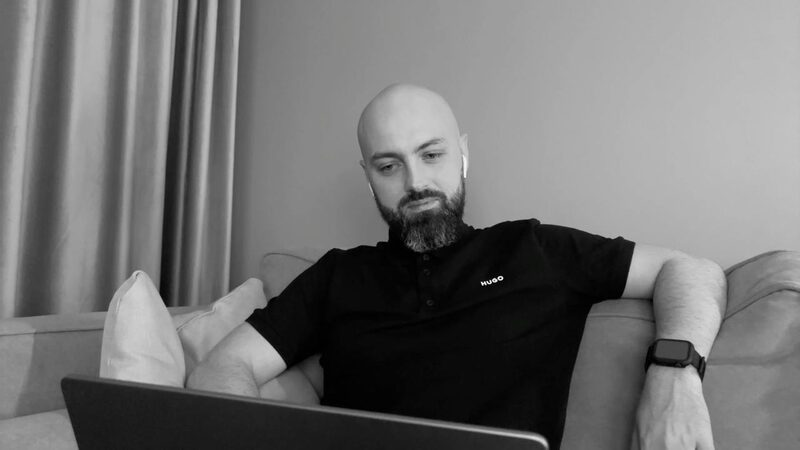
Telegram: https://koloskof.t.me

---

## Nisa Nord
привет! я Настя 👋

продуктовый дизайнер, раньше работала с Мишей в Юмани, сейчас — в Хедхантере

специализируюсь на дизайн-системах, из достижений: спроектировала с нуля новую дс хх на трёх платформах 😎

если моя экспертиза в связке с Финтех опытом будет полезна проекту — с радостью присоединюсь :)

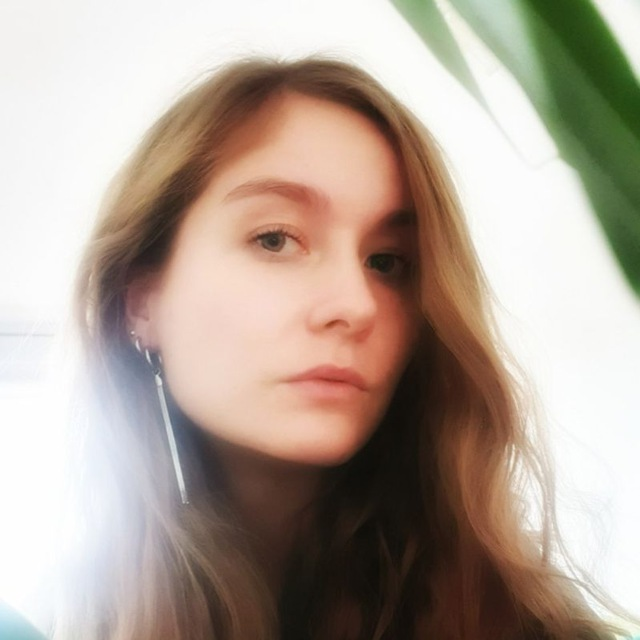
Telegram: https://nisanord.t.me

---

## Anastasia Lasaya
Добрый вечер! 
Я Настя, дизайнер бюро 1440. 
Занимаюсь проектированием интерфейсов для управления низкоорбитальных космических спутников. 
Ранее занималась разработкой агрегатора по поиску выгодных предложений валют и криптовалют по всему миру. 

Могу быть полезна:
- в аналитической проработке
- систематизации информации
- разработке дизайн системы 
- проведении интервью 

Рада присоединиться.

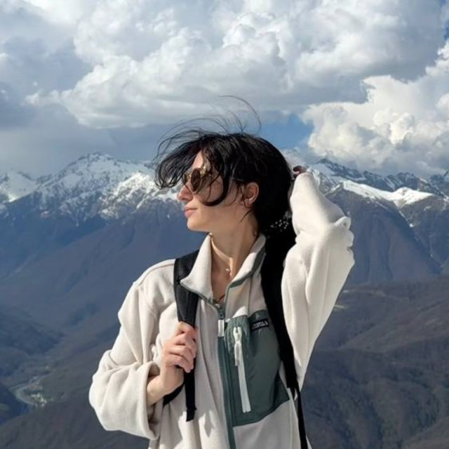
Telegram: https://lasaya_n.t.me

---

## Dima Isaev
Ребята, привет!

Меня зовут Дима, я уже больше 11ти лет в дизайне, 
— работал тимлидом в Авито, где занимался рекламой и монетизацией. 
— ранее как head of design строил лингва эдтех в Английском от Яндекс Практикума. 
— работал в Skyeng, но кроме эдтеха есть хороший международный SaaS опыт, развития стартапов в сторону монетизации 
— кроме продуктов, работал в ведущих рф дизайн-агентствах с разными типами b2b/b2c/ecom и т д проектов.

- Могу быть полезен чтобы дать новый угол зрения на проект за счет экспертизы в других сферах. 
- Добавить эмоций в проект.
- Собрать нужных и проверенных людей в недостающие слоты, т.к хороший нетворкинг. 
- Понимаю что такое социальный маркетинг, а так же умею в "read the room" (по-честному недавно узнал это выражение и оно прям про меня ;D)

пишу в свои тг каналы — они есть в профиле и развиваю собственное продуктовое дизайн-агентство isfirst.

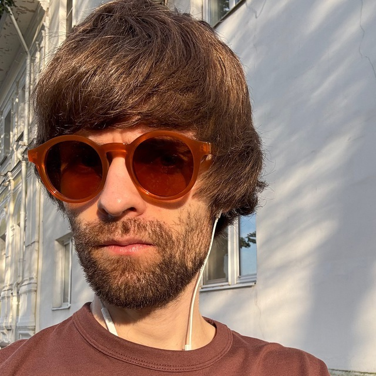
Telegram: https://easternleaves.t.me

---

## Oleg
Всем привет меня зовут Олег. 
Работал оч. много где.
Из интересного были
Skyeng - сервис обзвона телевокс да это благодаря мне вам звонили и предлагали записаться на платный урок по английскому )
Space307 бинарные опционы.
Usetech Госка строил новый сайт минцифры в роли тимлида  команды разработки и прочие сайты типа россотрудничества. 

Чем могу быть полезен: 
Создать бэкенд на php, go
Проработать архитектуру, монолит, микросервисы, модульный монолит и т.д.
Умею во фронтенд js, angular, но всё-таки не так хорошо как в backend.

Можно попрогать на каком-нибудь питоне, rust и прочих языках  в общем я открыт для новых технологий.

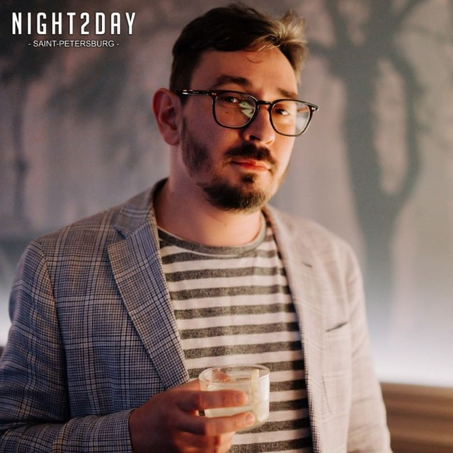
Telegram: https://unet903.t.me

---

## Игорь Старков
Привет, Я Игорь, Продуктовый дизайнер. Работаю в xsolla до этого - Альфа банк и ВТБ.
Линкедин тут
www.linkedin.com/in/igorstarkov

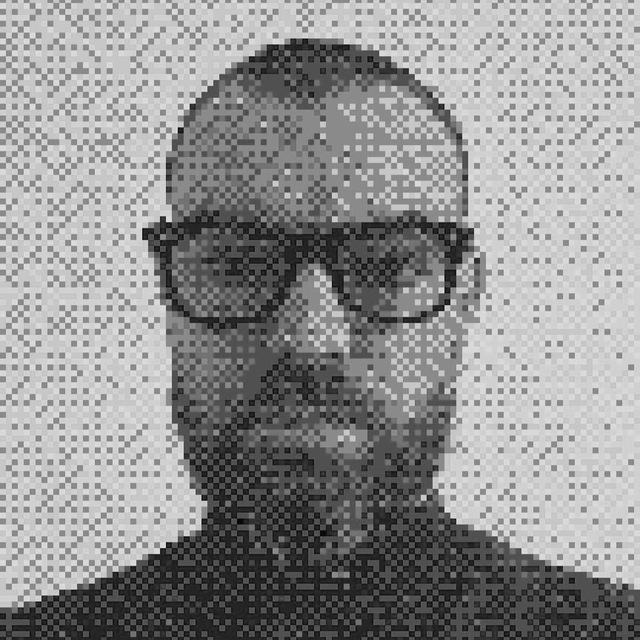
Telegram: https://igorstarkov.t.me

---

## Anzhelika Kondrateva
Привет! Я Анжела. Раньше была UX-редактором, работала в ЮMoney с Мишей. Потом перешла в дизайн: в Тиньке делала продукты для поддержки и разработки, а теперь в Альфе проектирую новый б2б-продукт. Рада присоединиться :)

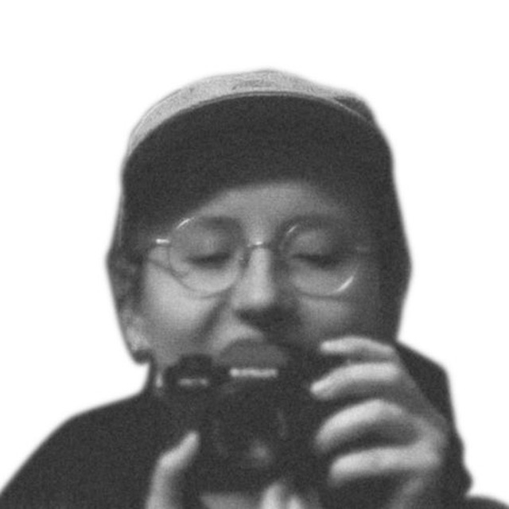
Telegram: https://kond_angelika.t.me

---

## Saveliy Bobov
Привет! Я Сава. 

Занимаюсь дизайном больше 16 лет — прошёл путь от дизайн студий и агентств, где был арт-директором, до крупных продуктовых команд. В Яндексе вместе с Мишей работал над Whitepaper, Бэм и дизайн-системой, сейчас в ЮMoney отвечаю за дизайн мобильных продуктов и продуктовые концепции как дизайн-лид. 

Запускал партнёрские проекты с X5, Столото и CD Projekt RED, Xioami, Yota и многими другими, собирал команды, перезапускал визуальный язык и помогал расти другим дизайнерам. Делал добро.

Всех обнял!

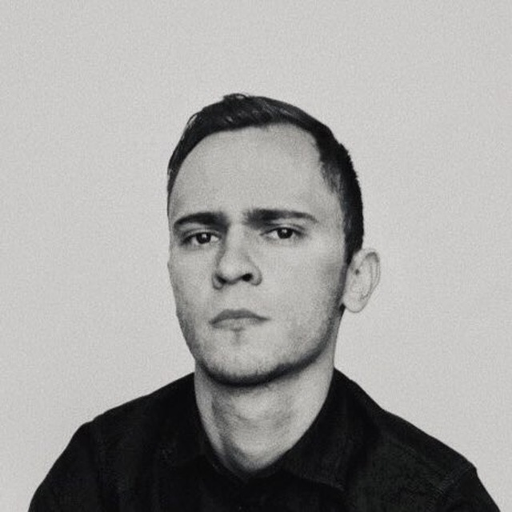
Telegram: https://Saveliy.t.me

---

## Daria Korobkina
привет, я Даша Коробкина 🐣

работала в Ю с самыми лучшими людьми на свете, начиная с Миши! у меня бэкграунд графического дизайнера и иллюстратора, но я очень люблю продуктовый дизайн и стараюсь постоянно в нем развиваться. из классного – запускала стартап для контроля за детьми, а в прошлом году работала ведущим дизайнером в американском стартапе Maroo (самое любимое и крутое – мои баннеры крутили на Таймс-Сквере 👽)

сейчас занимаюсь разными классными проектами

рада присоединиться!

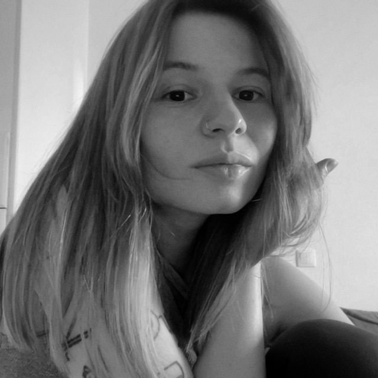
Telegram: https://@eshe_vina.t.me

---

## Aleksandr Zhelonkin
Коллеги привет! 

Меня зовут Саша Желонкин, сейчас работаю в Авито Финтехе продакт менеджером, разрабатываем финансовую платформу. 
Ранее занимался платежами в Гетт, эквайрингом в Klarna и платежным шлюзом в ACI Workldwide. 
Рад со всеми познакомиться) 👋

Telegram: https://alzdrt.t.me

---

## Aleksey
Привет!
Меня зовут Алексей и я проектирую пользовательские интерфейсы.
Спасибо Мише, что в свое время познакомил с БЭМ 🙏
За плечами цифровизация ГПН, платформы проектного планирования и управления данными, немного в NetState с блокчейном, немного в AI-помощник для работы с нормативной документацией. Сейчас работаю в Nexign над BSS-системой.
Люблю пешие прогулки, кофе и хорошую беседу.
Рад знакомству 🙂

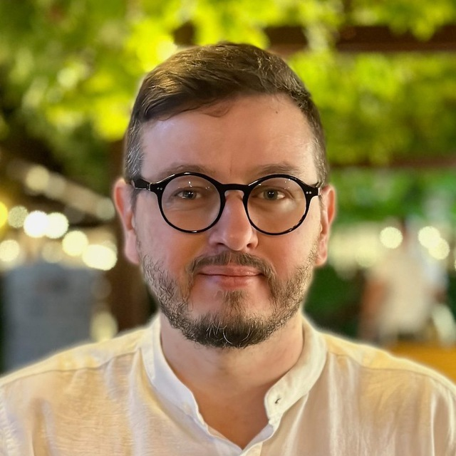
Telegram: https://bay311.t.me

---

## Denis Sbitny
Привет.
Я Денис — арт-директор дизайн-системы (и не только) в Авито. Люблю пиксели, компенсации, чистые цвета, выверенные отступы, правильную типографику.

Свой первый дизайн продал в 2002 году. Это был логотип, сделанный в Corel Draw 9. В общем, повидал многое. Теперь я здесь

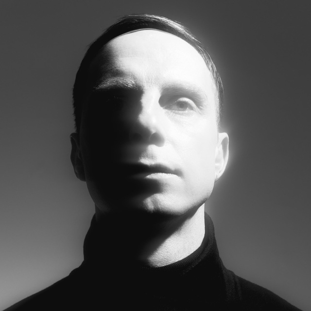
Telegram: https://sbitny.t.me

---

## Sasha
Привет. Я Саша. Дизайню 16 лет. 
Основной профиль вэб и ком дизайн. 
В качетсве развлечения делаю иногда шрифты. Один из примеров(лендос собрал на редимаге, поэтому нужен впн).

Telegram: https://abyssssce.t.me

---

## Victoria Mikhailenko
Привет! Я Вика, продуктовый дизайнер в Авито Финтехе. Занимаюсь транзакционным опытом и развиваю платежные формы. А еще могу быстро собрать эффектную презентацию и имею бэкграунд в граф дизайне. Рада знакомству! 🖤

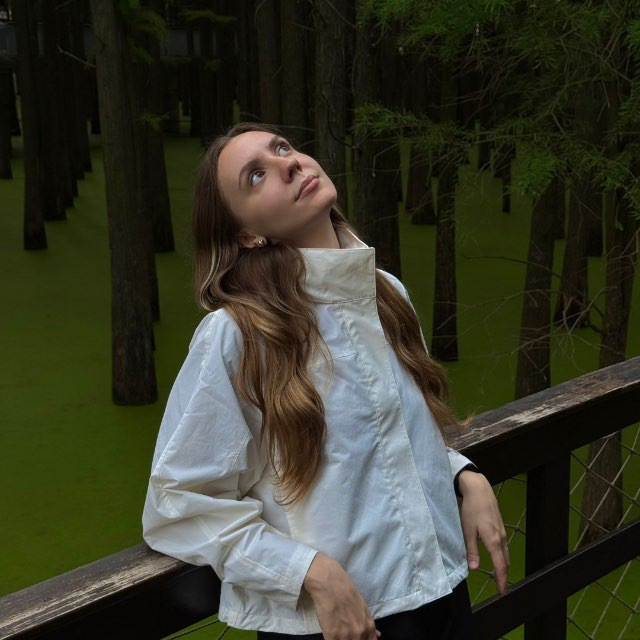
Telegram: https://mikhaylenkovi.t.me

---

## Полина
Всем привет!
Я Полина - рекрутер в направлении продакт менеджмента, а до этого занималась наймом дизайнеров в компанию Авито🌏

Помогаю нанимать классных ребят, а также постараюсь найти заинтересованных людей в этом комьюнити🌷

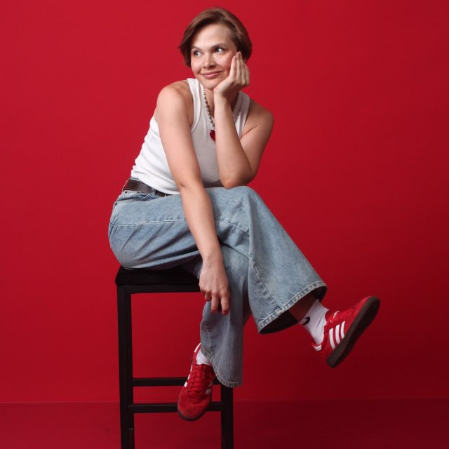
Telegram: https://apollinariss_hr.t.me

---

## Mikhail Galushko
Меня зовут Михаил Галушко, и я работаю в области проектирования, развития и продвижения цифровых интерфейсов и сервисов уже более 25 лет. 

Я имел честь сотрудничать с такими крупными компаниями, как Альфа-Банк, Ренессанс Страхование и Центр Финансовых Технологий, а также с различными агентствами, такими как UsabilityLab, AIC и Actis Wunderman. Мой опыт охватывает широкий спектр задач — от проектирования пользовательского опыта до управления командами и преподавательской работы.

Мои компетенции:
- Проектирование взаимодействия, пользовательского опыта, информационной архитектуры сайтов, мобильных приложений, личных кабинетов, систем дистанционного обслуживания и интерактивных сервисов.
- Разработка интерактивных прототипов для десктоп-решений и мобильных приложений (Axure RP, Figma)
- Настройка дизайн-процессов на стороне заказчика, формирование и развитие команд продуктовых дизайнеров, проведение оценки и грейдирования специалистов, создание и внедрение дизайн-системы
- Проведение образовательных мероприятий по теме дизайн-мышления, проектирования и управления цифровыми продуктами

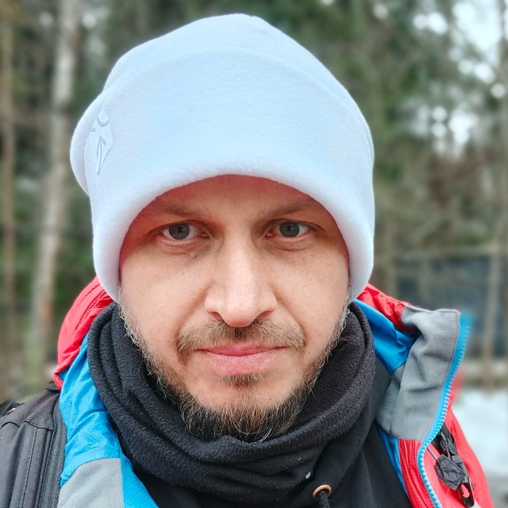
Telegram: https://Galushko.t.me

---

## Ilya Kazakov
Привет! Я Илья.
Руковожу Data Science практикой в рисках в цифровом банке, D360, в Саудовской Аравии.

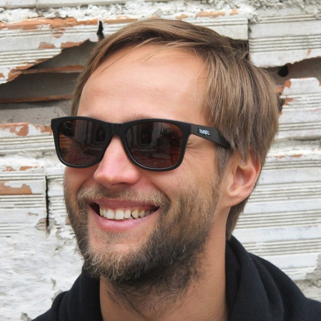
Telegram: https://ilyakazakoff.t.me

---

## Владислав Голубев
Привет всем
Я Влад
- Работал 5 лет проектным менеджером, вместе с командой создавал программу для управления фармацевтическим складом
- работал чуть больше года frontend разработчиком
- 3 года работал продуктом в Еком
- последний год работаю продуктов в финтехе

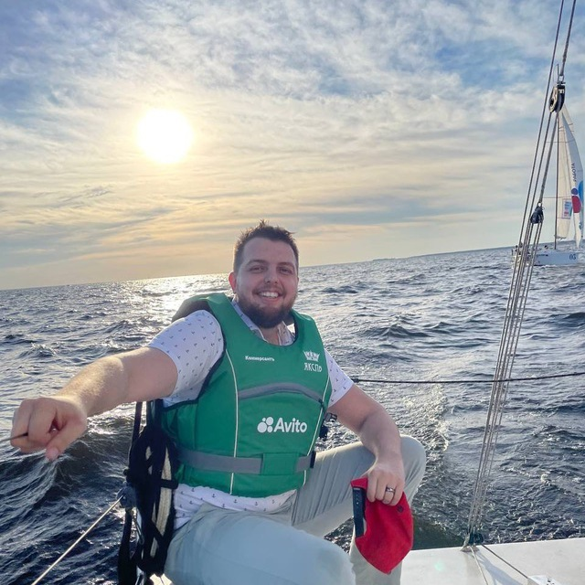
Telegram: https://vladbrave.t.me

---

## Anton Frolov
Привет! Я Антон, CPO в place01 — делаю продукт на стыке AI, трейдинга и крипто кастодиала. До этого был в Wargaming, Wrike и Яндексе. В продакт-менеджмент пришёл из дизайна. Идея показалась классной, постараюсь быть полезным.

Telegram: https://frolov.t.me

---

## Виктор Борисов
Всем привет! Меня зовут Виктор - ETL Avito, занимаюсь техническим развитием Авито Кошелька. В прошлом - поднимал ИИ стартап в роли CTO, запускал в роли трайб лида стартап Altery, курировал разработку бюджетного планирования для МФ РФ
Рад присоединиться!

Telegram: https://Viktor_Borisov.t.me

---

## Dmitry Santalov
Привет) Я Дима, продуктовый дизайнер в Авито. Один год занимался интеграцией ОФП в автокредиты: анкета, личный кабинет, точки входа. Сейчас развиваю пользовательский опыт в Авто, влияю на всю воронку.

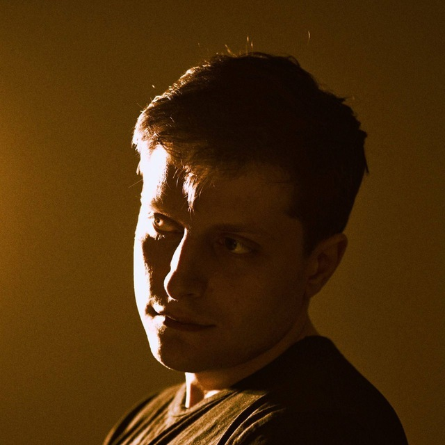
Telegram: https://dmitrysantalov.t.me

---

## Egor Nikitin
Всем привет!
Я Егор, продакт в Точке, занимаюсь ростом оборотов по картам. До этого работал в финтехе (трейдинге), сначала занимался всем тем, что связано с активацией пользователя и рефералкой, а потом лидил направления персонализации и коммуникаций. Люблю в цифры и аналитику. Рад присоединиться)

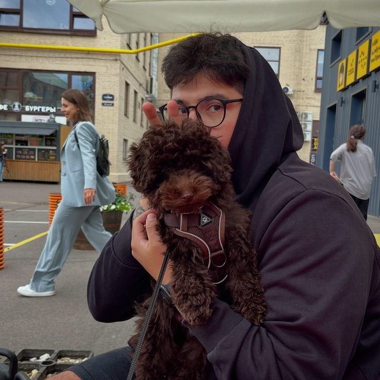
Telegram: https://lesthetiq1.t.me

---

## Yuliya Krasnova
Всем привет! я Юля, лид-дизайнер внутренних продуктов Яндекса 

Занимаюсь всем, что помогает яндексоидам в их работе: от сервиса, через который можно записаться на внутренние мероприятия с друллегами, и инфопортала — до CRM и базы знаний для нашего саппорта. Ещё мы делаем фиджитал — тачскрины с картами офиса, возможностью напечтать себе бейдж и забронировать умный локер.

Люблю наблюдать за развитием и проектированием городов и пространств, сопоставлять это с поведением людей и искать закономерности. Очень нравится делать из сложного простое и доступное для всех (привет всем, кто тоже топит за A11y)

🦕

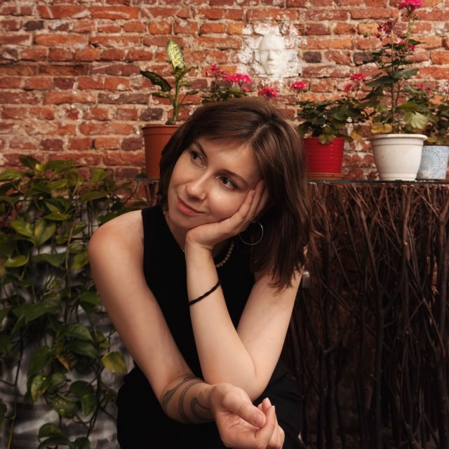
Telegram: https://krsnva.t.me

---

## Миха Gunin
Приветы, я Миша - pm в финтехе Авито. Одно из моих направлений - интерфейсы оплаты, и у нам повезло сделать классный продукт. До Авито сделал Vk taxi и даже сбер такси 🚕. А до этого делал финтех и не только для участников госзакупок.

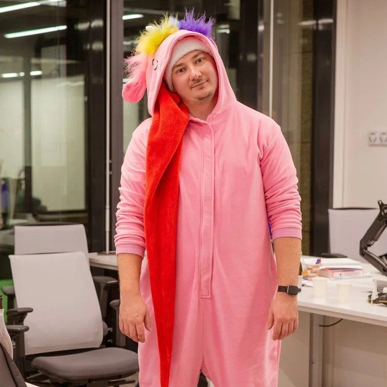
Telegram: https://brogital.t.me

---

## Dmitriy Volkov
Привет! Я — Дмитрий Волков из команды ЮMoney. Занимаюсь развитием продуктовой линейки электронного кошелька - от денежных переводов и краудфандинга до опенбанкинг

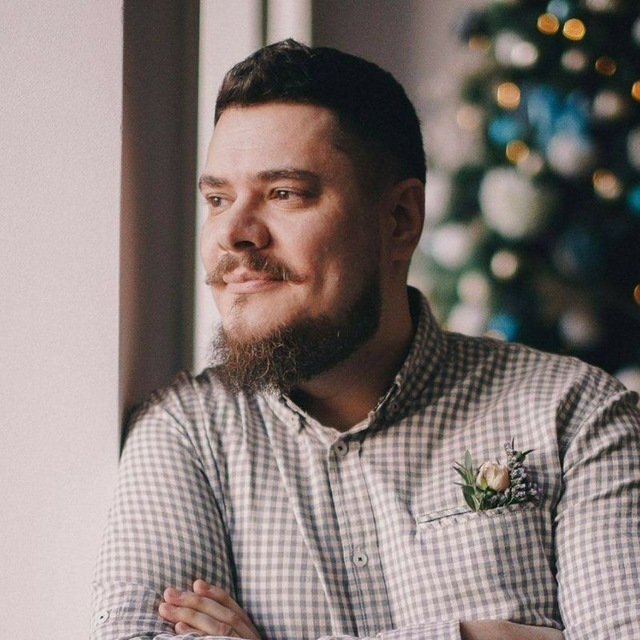
Telegram: https://dmitriykvolkov.t.me

---

## Veronika Nikolaeva
Привет! Я — Вероника Николаева из компании АБЦТ, развиваю несколько сервисов и два мобильных приложения в Акбарс Банке.

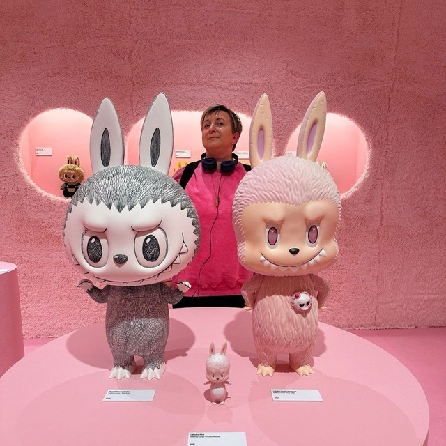
Telegram: https://mactopus.t.me

---

## Anya Bryleva
Привет всем!
Очень классный проект и классные люди))

Я Аня, работаю в биздеве нового бизнес-юнита Yango (межнар Яндекса) — строим маркетплейс в Африке и Латаме. В финтехе поработать не успела, но надеюсь быть полезной!

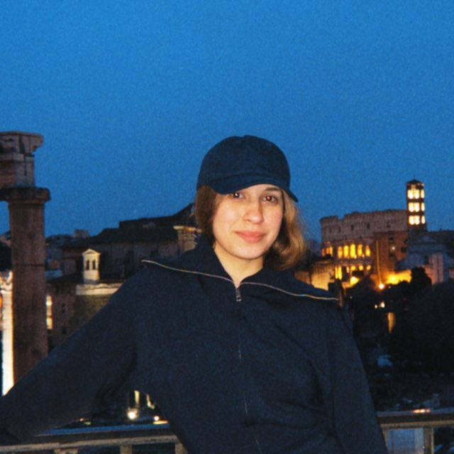
Telegram: https://abryleva.t.me

---

## Zhantos
Всем привет! Я Жанна, продуктовый дизайнер в банке «Санкт-Петербург». Проектирую PWA для банка, развиваю нативное приложение для физических лиц и воюю с ЦБ по поводу адекватной реализации цифрового рубля. 
Последние полгода активно развиваю направление исследований в банке — помогаю формировать пользовательские стратегии и оптимизировать клиентский путь. Присоединилась с оптимизмом и открытостью к новым идеям, готова к коллаборациям и обмену опытом, хочу быть полезной 🌝

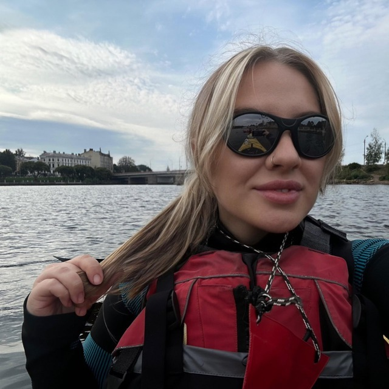
Telegram: https://Zhantoss.t.me

---

## Natalia Gureeva
Всем привет!

Я Наташа, исследователь в финтехе Авито. На данный момент больший фокус в продукте на пользовательский опыт рассрочки на покупку товаров, однако в целом «головой» отвечаю за все исследования кластера.

Ранее работала в Купере (экс-СберМаркет): в зоне ответственности был главный экран, чек-аут/пост чек-аут, самовывоз, а также лидировала с точки зрения исследований новый продукт как в СМ, так и в ретейле в целом – ScanPay (онлайн-оплата покупок в оффлайн-магазинах) - https://lenta.ru/news/2024/04/11/pokupok/
До СберМаркета работала в МегаФоне в формате инхаус-агентства. 

Буду рада новым знакомствам и совместной работе!

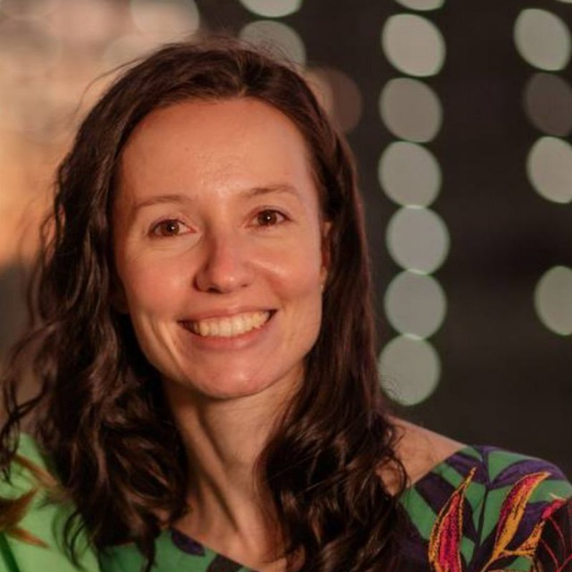
Telegram: https://NGureeva.t.me

---

## Artem Dmitriev
Всем привет! Я Артем, продуктовый дизайнер. Занимался 2.5 года моб дс и проектировал сценарии для моб приложения(b2c) в Райфе. Сейчас занимаюсь моб приложением B2B банком в ВБ. Умею строить дизайн для мобилки чтобы это было удобно, красиво и не дорого для разработки

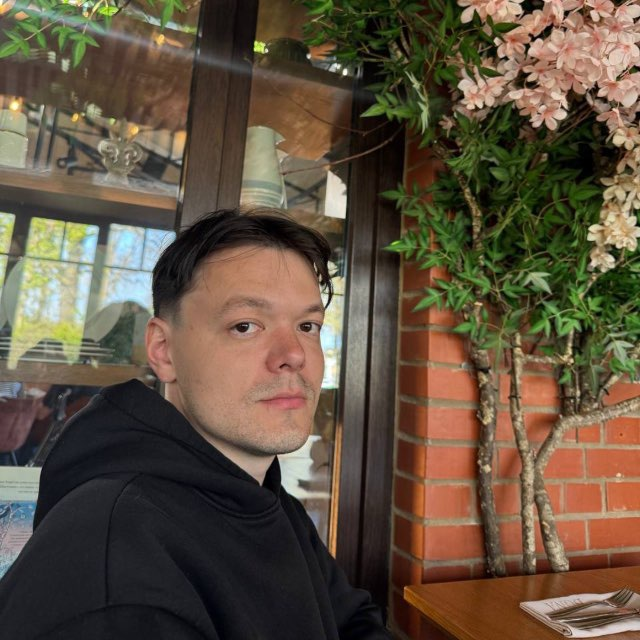
Telegram: https://ee_makarena.t.me

---

## Просто Кирилл
Всем приветы,
я более четырёх лет разрабатываю B2B‑продукты, улучшая пользовательский опыт с помощью исследований, аналитики и дизайна. Последнее место работы Самокат.

Обо мне:
– Всего 9+ в дизайне (5 лет на фрилансе, 4 года в продукте)
– Запускал с нуля несколько приложений и веб-интефейсов (в том числе на международном рынке)
– Создавал и поддерживал дизайн-системы
– Вёл задачи от Discovery до релиза

Так же есть опыт лида:
– Регулярно проводил дизайн-ревью у других дизайнеров
– Менторил младших дизайнеров
– Инициирую улучшения в процессах и интерфейсах
– Проводил 1 на 1, собесы и тд

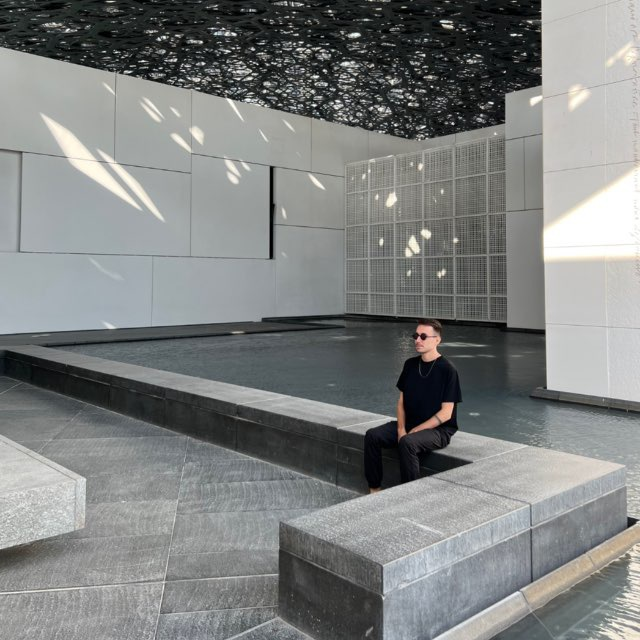
Telegram: https://korolevdsgn.t.me

---

## Irina Kim
Всем доброго вечера 🦚

Я более 6 лет создаю и развиваю b2b/b2c продукты.

Сейчас в т-банке год развиваю автоплатежи на кредитные продукты фл.

2 года в SMLT развивала платформу по трекингу девелоперских проектов для управляющих должностей и c-level 

2 года 
Создавала с нуля мобильное приложение казанского девелопера Ак барс дом. 

Занималась автоматизацией процессов.

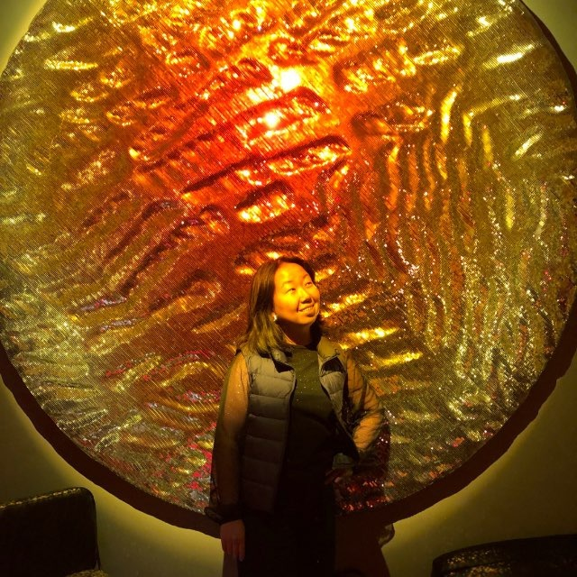
Telegram: https://kimirina13.t.me

---

## Evgeny
Работал в:
AltergoSky - сервис спутниковой связи, занимался написанием софта для анализа трафика и обработки протоколов канального уровня (C++, Java)

Разрабатывал для госки бэкэнд под сервис распознавания речи (whisper) на 30+ видеокарт (Spring Boot, python)

Разрабатывал много интернет магазинов с 0 и до деплоя

С нуля был на проекте два года в автоматизации сервисов  под контроль жкх (мориторинг теплосетей) (Java)
Участвовал в разработке бэка для биржи Bitget

Чем могу быть полезен:
Создать бэкенд на Java (Spring boot), есть опыт с kotlin/ AndroidSDK(Java)
Что-то пописать на go, c++
Во фронте неоч, только js (jQuery)

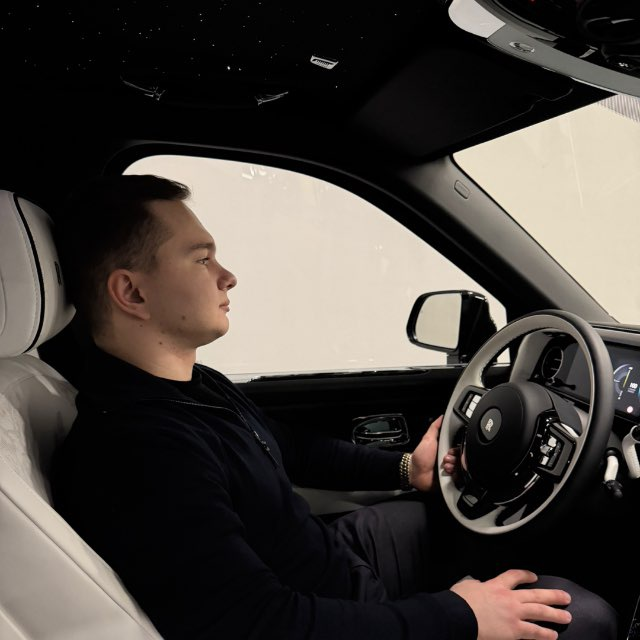
Telegram: https://oldfredddy_develop.t.me

---

## Valentine Nazarova
Привет! Я продуктовый дизайнер, Авито. В опыте Сбер, ПСБ, чуть МТС банк, чуть стартапы (аукционы по авто, аукционы по RWA NFT).

Где бы я ни была - занимаюсь внутренними продуктами, сложными системами - админки (логистика, маркетинг), кол-центры, помощь, интерфейсы для операторов, таблицы-графики-дашборды, логическая проработка архитектуры сервисов

Что хочу/могу поковырять в этом проекте - то, что связано с донесением объемной информации компактно. Сейчас это сниппеты, возможно будет что-то еще, когда закончим с базовыми компонентами. Еще могу челленджить идеи, собирать всякую информацию и пересобирать ее (в сниппетах это как раз понадобится, могу к продуктовой части сниппетов тоже заходить)

Ну и очень рада буду понетворкать именно, соскучилась по продуктово-дизайнерской тусовке за пределами работы. Рада познакомиться!

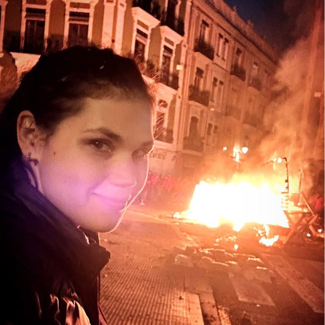
Telegram: https://PalaVistas.t.me

---

## St Nikolay
Всем привет! Тоже расскажу немного про себя:
Я долго работал в авто: делал аналитическтй сервис внутри CarPrice, потом Автотеку и Авито Аукцион в авто.
После этого свернул в финансы, занимался BaaS платформой в ВТБ, и в целом парнерствами, например у нас был крутой эксперимент по цифровой ипотеке на Авито.
Оттуда ушел в венчур делать универсальный чекаут сервис.
Потом вернулся обратно в ВТБ в daily banking (дебетовки, ВТБ Pay)
А сейчас занимаюсь локализацией платежной инфраструктуры в ETG (в России это Островок): QR платежи, AliPay, рассрочка, cash account, вот это вот все по всему миру.
С удовольствием готов поделиться успешным и провальным опытом и вообще вместе поштормить

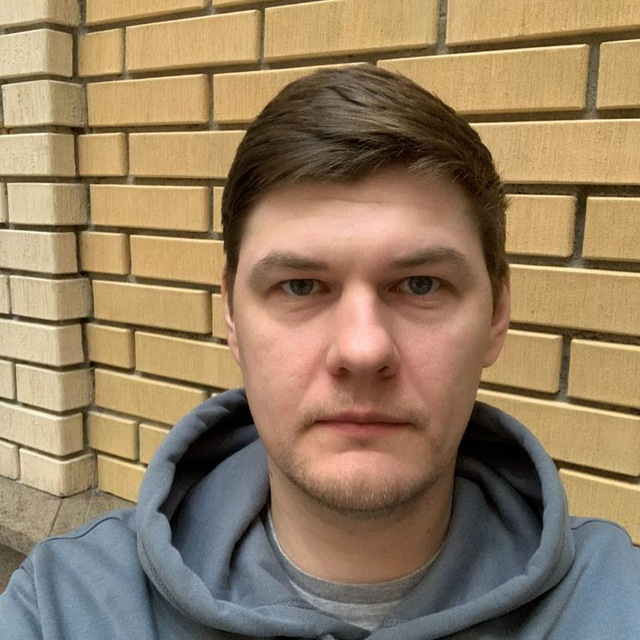
Telegram: https://Kokastepanov.t.me

---

## Elena Evgeneva
Всем привет! Я Лена, продакт-менеджер в ЮMoney

В финтехе около 10 лет: начинала в ЦФТ с web-проектов, затем в «Кукурузе» была аналитиком мобильных продуктов, развивала микрозаймы в СМСфинанс — там лавировала между комплаенсом и архитектурой, участвовала в переходе на микросервисы и прокачивала UX в точках касания на сайтах и в мобильных приложениях.
Каждый год была на Profso UX в СБП и училась дизайн-мышлению и продуктовому подходу, что привело к переезду в Питер и в Яндекс.Деньги.
Сейчас в ЮMoney развиваю мобильные приложения, а до этого с @koloskof в web-команде сделали успешный софт лонч редизайна Портала (с жёлтенького дизайна Яндекс.Денег переехали на фиолетовый).
Моя суперсила — видеть связь между архитектурой, UX и целью в цифрах. Умею отрезать лишнее для MVP. Умею в Amplitude, AppMetrica и GA.

Дома попиливаю pet-проекты с telegram-ботов web-парсеров и AI , постепенно осваиваю ML.
Рада знакомым лицам и открыта к нетворку и обмену опытом ❤️

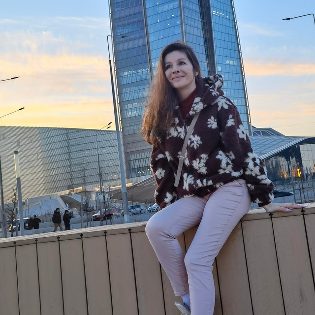
Telegram: https://finding_unicorn.t.me

---

## Артем Громов
Всем привет!
Занимаюсь графическим дизайном, в основном — иллюстрации, иконки, логотипы (монограммы). Работаю в сфере около 14 лет, на фрилансе.

Работал с ВК, Одноклассники, Пикабу (лого все ещё висит) в студиях М18, Ribbon Design, с клиентами и посредниками, в основном, с иностранными (Китай, США, Хорватия, Испания).

Разрабатывал иллюстрации для сайта, иконки для приложений (iOS, Android), иконки для интерфейса. В последнее время — интерфейсы для мобильных игр (полная отрисовка всего UI, иллюстраций, логотипа и иконки), иллюстрации в сфере гэмблинга.

Основная масса работ под NDA.

Портфолио — https://dribbble.com/Ampeross, https://www.behance.net/Ampeross

Работаю в фигме, в фотошопе, на изучении Spline, иллюстратор, контролируемые генерации в Stable diffusion.

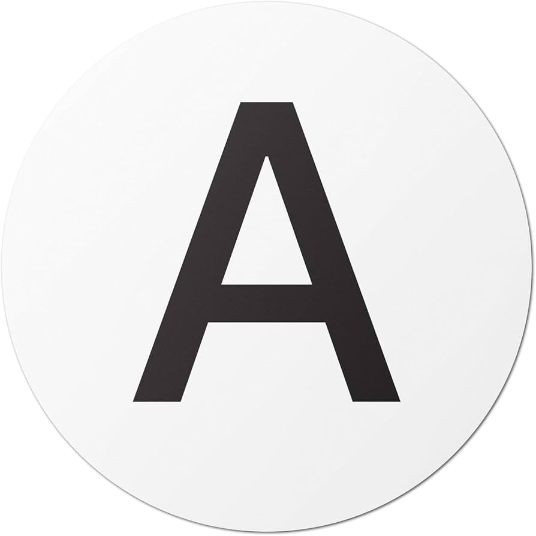
Telegram: https://Ampeross.t.me

---

## Nikolay
Привет! Я Коля, CPO в брокере Риком, до этого был в Платформе Больших Данных, DataUnicorn и ХоумБанкк. Еще есть опыт в FMCG «в прошлой жизни». Рад знакомству )

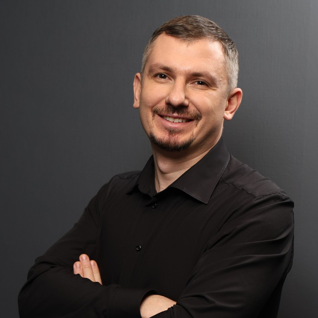
Telegram: https:/MVP_02.t.me

---

## Isaeva Narmin
Привет! Я Нармин, развиваю стратегические финтех партнерства в Авито👋

Умею в стратегию, анализ рынка, фин моделирование, и в целом понимаю финтех (в Авито мой фокус на Кошельке, кредитах и платежах)
Буду рада поконтрибьютить в релевантные блоки в Роллаут)🔥

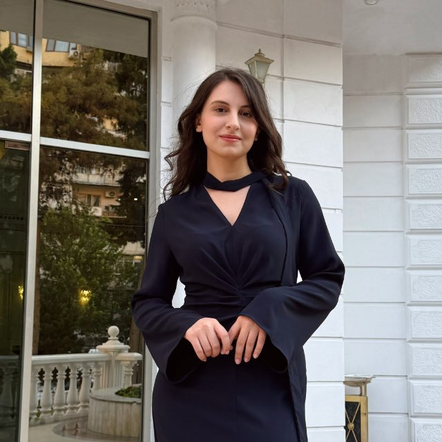
Telegram: https://isaevanar.t.me

---

## Yuliya Orlova
Привет, я Юля, влалелец продукта в аутсорсинговой компании. 12+ лет в банке в премиум продуктах.
Как продакт работала в стартапе по озеленению, делала мобилку и вебку для Пушкинской карты, сейчас развиваю фин продукт для аутсорсеров.

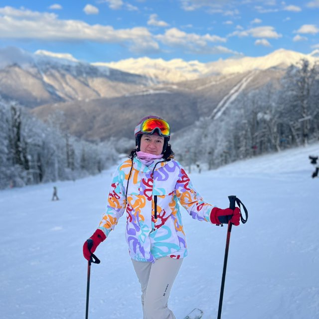
Telegram: https://yu_orlova.t.me

---

## Kirill Afonin
Привет!
Это Кирилл, делаю продукты десять годиков. Последние шесть лет в финтехе. Потрогал почти всё: KYC, AML, платёжки (встроенные формы, новые платёжные методы, крипто-платежи), кошельки, выпуск и развитие карт

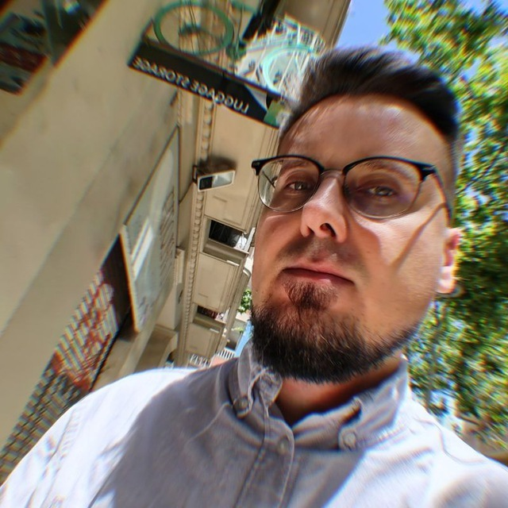
Telegram: https://masinskiy.t.me

---

## Dmitrii Bobkov
Привет! Я Дима, уже больше двух лет занимаюсь финтех направлением в Авито. Делаю Авито Кошелёк с самого нуля и другое

До этого 3 года работал в Альфа Инвестициях и Открытие банке

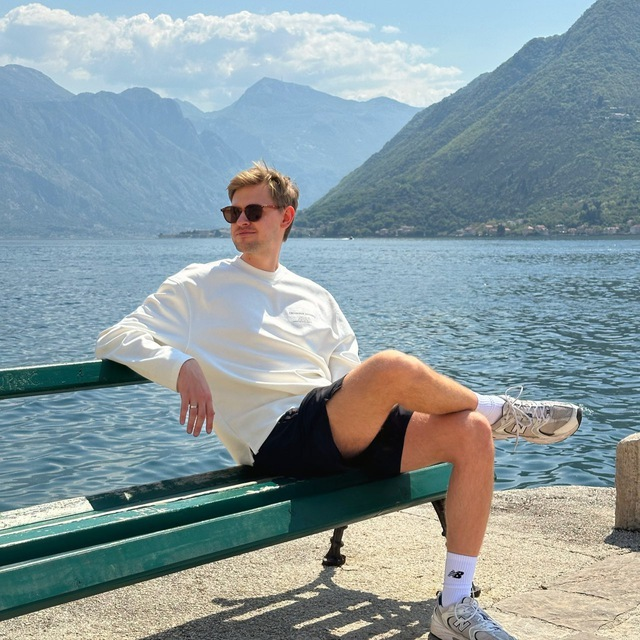
Telegram: https://bobkov_dr.t.me

---

## Nadezhda Lebedeva
Привет! Я Надя, продуктовый дизайнер в студии Red Collar. В дизайне 2 года, до этого работала финансовым аналитиком.

У меня пока не так много опыта в финтехе, но хочу поучаствовать и помочь в развитии РОЛЛАУТ. Могу подключаться на небольшие задачи по проработке UI-сценариев, прототипов, поддержке дизайн-системы

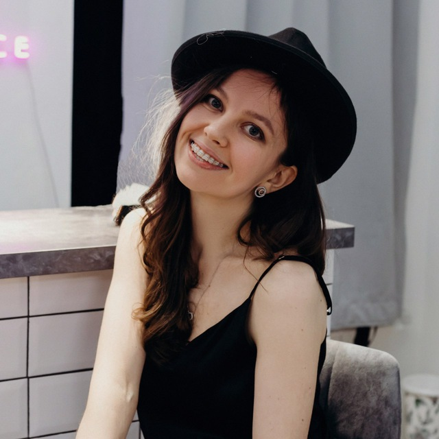
Telegram: https://LNadezhdaM.t.me

---

## Valeriy Balulo
Всем привет! Рад присоединиться к такому осмысленному проекту. 👍
Мой опыт - на стыке стратегии, продуктового менеджмента и платёжных технологий. Готов подключиться по всем этим тематикам.

Telegram: https://Balulo.t.me

---

## Anton Blinkov
Ребята, всем привет!

Я Антон, продуктовый дизайнер и в прошлом немного предприниматель и основатель
— работал тимлидом в Т-Банке, где развивал направление Кэшбэк и Бонусов (вся лояльность).
— был со-основателем агентства Blink Agency. Делали дизайн для финтеха и блокчэйн стартапов.
— делал дизайн первой версии для приложения loona, которое было отмечено apple design awards 2021 и best app of the year в google play 2020
— пробовал запустить несколько своих стартапов (CMcourse, Lightsach, Men’s Flame) но не удалось поднять инвестиции.

Буду рад помочь в развитии продукта (но чуть позже 😅, сейчас процесс адаптации на новом месте). Все здесь такие крутые и классные 👀, буду рад в целом пообщаться.

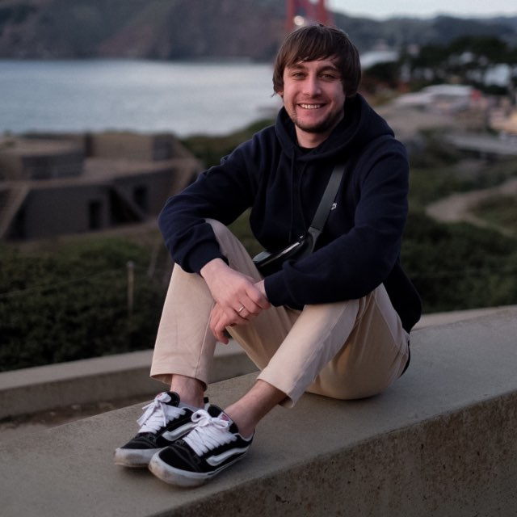
Telegram: https://anthony_rich.t.me

---

## Nikita
Всем привет 👋 Я Никита, в Авито лидирую бизнес направление платежных продуктов и сервисов, до этого был в McKinsey, Райфе, ГПБ, ВТБ, ДОМ.РФ. В основном опыт связан с розничным направлением, отвечал за продукт, например кредитные карты, за разработку, внедрение, мониторинг розничных стратегий (продукты, сегменты, каналы), а также немного по касательной задел МСБ часть. Рад знакомству)

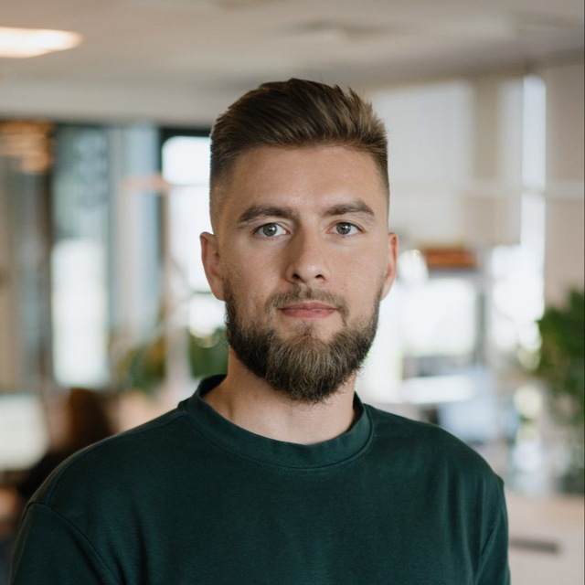
Telegram: https://atikkin.t.me

---

## Сергей Денисов
Приветствую всех!
Основной язык C#, основной опыт в разработке консольных и десктоп приложений. Работал с пакетными структурами на уровне операций над битами/байтами.

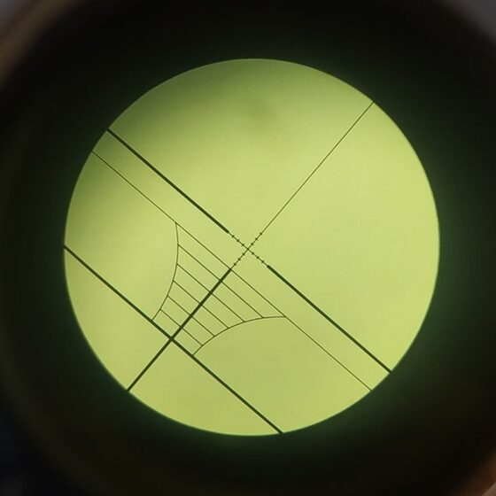
Telegram: https://PressFtoRespect8.t.me

---

## Pavel Nesterenko
привет всем!

я Паша, дизайнер и арт директор, работал в Surf (мобильные приложения) последние 8 лет.

Делали очень много разного - фуд тех, е-ком, финтех (банки, криптобиржа), медиа стриминги и прочее. Преимущественно в формате мобайла. Люблю финансовые продукты и в целом эту тему, особенно личные финансы и инвестиции.
p.s. сейчас ищу работу

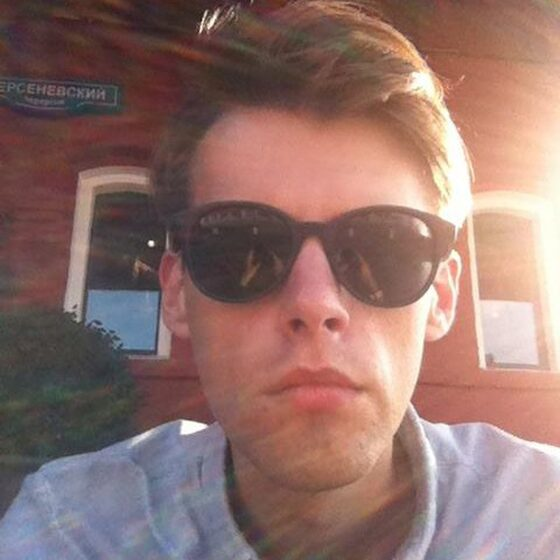
Telegram: https://pavelnesterenko.t.me

---

## Masha Boroukaeva
Всем привет!) я Маша — продуктовый исследователь

Специализируюсь на финансовых сервисах: начинала свой путь исследователя с работы в Markswebb, помогала строить финпродукты в Яндексе, а теперь — в Авито

В бытность до исследователя короткое время была стратегом и специалистом по корп инновациям (но это было оч давно)

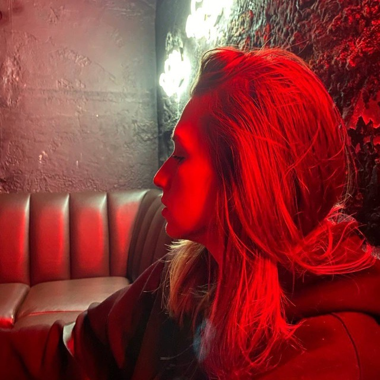
Telegram: https://cheranka.t.me

---

## Sergei Romanov
Holla!
Я Сергей, BizDev в Runet Business Systems - российском подразделении BPC (разработчик платформы SmartVista). Отвечаю за развитие нового продукта в сфере массовых выплат по модели White Label.

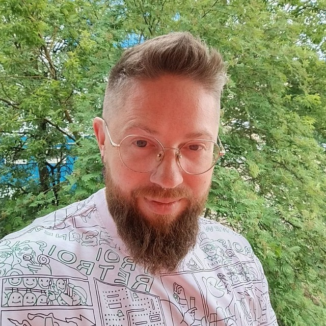
Telegram: https://WickedCarter.t.me

---

## Вилена Шигапова
Привет! Рада быть частью такой классной группы.

Я Вилена, в дизайне — больше 18 лет. Начинала в фотостудии и типографии, работала в маркетинге крупных компаний (Евросеть, бренд LEGO). Умею в моушн — делала 2D-анимацию для QIWI. Училась в Британке, Skillbox, BBE, у Юры Ветрова и других. Из необычного — было интересно разобраться, как создавать ML-продукты с позиции продакта (MathsHub). Люблю каллиграфию и леттеринг. Немного понимаю Python.

Работала проектно с командой Иннополиса и бизнес-трекером над концептом мобильного приложения в рамках программы исламского банкинга. Первый спроектированный интерфейс был для стартапа в 2014 году (собран в Ai/Ps). Проектировала логику форм инвестиционной платформы Karma.

До перехода в дизайн получила экономическое образование. Тогда же проводила исследования для реального бизнеса. Сейчас снова интересуюсь темами экономики, инвестиций, технологий и предпринимательства. Пока записываю идеи, исследую, пробую развивать. Состою в разных сообществах вроде Women in Tech, NFNG, читаю про венчур, ИИ, инвестиции и стартапы. С 2021 года изучаю тему блокчейна.

В прошлом году участвовала в опенсорс-проекте по разработке маркетплейса.

Что интересно и с чем могу помочь сейчас: исследования, проработка логики, брейншторминг идей, стратегия, верхнеуровневые концепты. Могу помочь с текстом — такой опыт тоже был.

P. S. Сейчас ищу работу и открыта проектам как арт-директор в коммуникациях или продуктовый дизайнер.

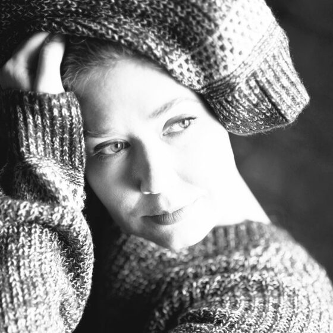
Telegram: https://vilena_me.t.me

---

## Марат Ибрагимов
Всем привет!
Меня зовут Марат Ибрагимов.
Я продакт в EdTech проекте УОМ - это проект про превентивную медицину.
Параллельно курирую продукты в iGaming - крипто проекте.
Работал с десятком стартапов, в основном это этап rnd и первых нескольких итераций.
Периодически записываю интервью и подкасты с интересными мне людьми.

Чем буду полезен:
- я креативный, могу поштурмить что-то, нетривиальное решение придумать.
- помогу с РнД
- поделюсь контактами продактов знакомых и предпринимателей.

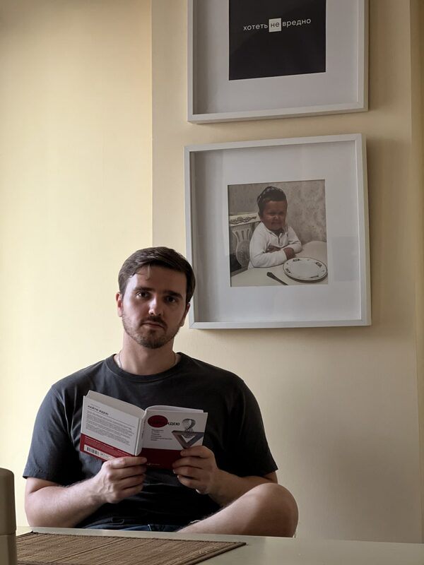
Telegram: https://marat_ibrgmv.t.me

---

## Валентин
Привет!
Я Валентин, девопс в индастриал-тех (всякие «заводы», датчики, сети, пром-сервера и разработка под них).
Zabbix, Grafana, Terraform, Ansible, Docker, k8s, управление инфраструктурой, автоматизация, мониторинг - вот это всё.
Финтех не щупал, но при наличии свободного времени с радостью помогу.

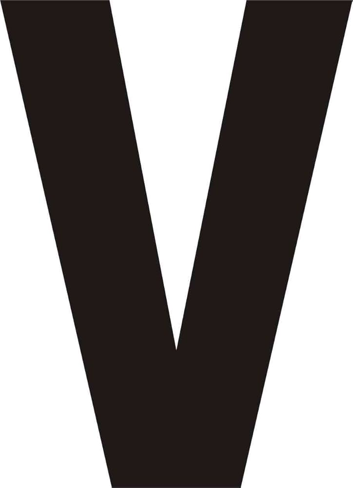
Telegram: https://Airport_Man.t.me

---

## Андрей Анашкин
Всем приветики!
Я Андрей Анашкин, дизайнер, разработчик, музыкант, лектор (вставьте любое увлечение). Работал в яндексе, газпром нефть, сбердевайсы, акбарс банке, сейчас в авито.
Пишу плагины для фигма и музыку.
Обожаю сложные задачи по дизайну. Более подробно есть на моем сайте :)
Рад присоединится к команде ❤️

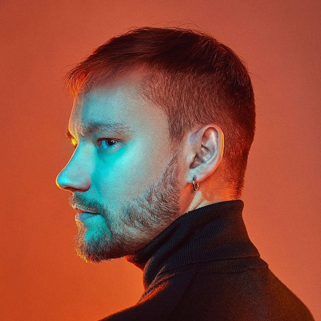
Telegram: https://andexds.t.me

---

## Tatyana Lebedeva
Привет привет🤗

Меня зовут Таня. Я продуктовый дизайнер в HRtech. Стараюсь вести свой канал, но пока на это мало времени)))

Открыта новому!
Очень рада познакомиться с вами🤩

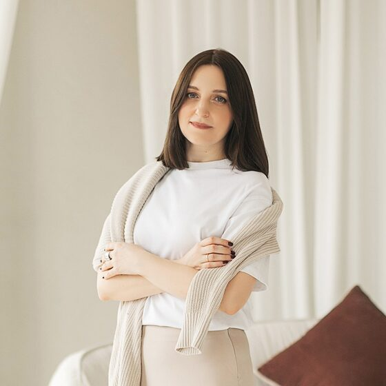
Telegram: https://Lebedeva_Tatyana.t.me

---

## Катя Брусенцева
Привет-привет 👋

Я Катя, продуктовый редактор в Авито. До этого несколько лет работала в медиа, больше всего в РБК и Бизнес-секретах. 

Готова помогать с текстами в разных форматах: от статей до интерфейсов. Рада к вам присоединиться!

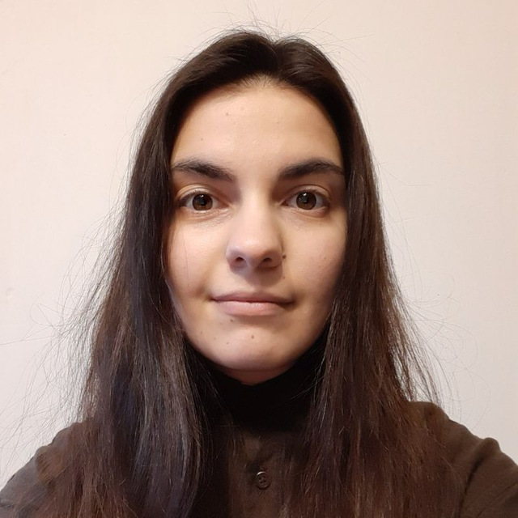
Telegram: https://katya_brus.t.me

---

## Мария Шкунарская
Привет! Я Мария Шкунарская, из Казахстана.
Работаю в Rocket Tech, руковожу дизайном как Tech Lead.

В IT я уже больше 12 лет — сейчас веду финтех продукты, занимаюсь курированием аутсорс и аутстаф. Успела поработать в Kaspi, Bereke bank, EPAM, Usabilitylabkz, Kazdream и в куче разных проектов: в основном b2g и b2b, но и с b2c немного сталкивалась.

Когда-то активно менторила и преподавала, сейчас взяла паузу и фокусируюсь на себе — хочется развиваться в своём темпе.

Развиваю дизайн сообщество в Казахстане.Периодически собираю дизайнеров на бесплатные завтраки в Астане (реже в Алматы) — иногда просто встречаемся в барах, ездим на шашлыки или ходим в горы. В общем, люблю собирать классных людей рядом :)

Буду рада знакомству и общению!

Telegram: https://katya_brus.t.me

---

## Oleg Bu
Всем привет! 👋

Меня зовут Олег Бухтияр, я делаю Screen Gallery — проект, цель которого собрать скриншоты лучших приложений из России и СНГ:
👉 https://scrn.gallery

Также веду телеграм-канал проекта, где делюсь не только обновлениями, но и отборными находками и дизайн-инсайдами из оцифрованных продуктов:
👉 https://t.me/scrn_gallery

Буду рад помочь с поиском референсов, дизайн-аудитом или оцифровкой ваших конкурентов.

Открыт к предложениям и коллаборациям 🙂

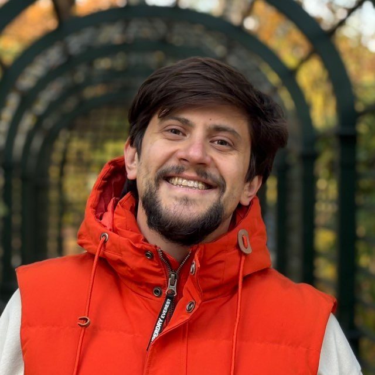
Telegram: https://katya_brus.t.me

---

## Olya Kanevskaya
Привет всем

Я Оля, Head of PMM в Авито Доставке. 13 лет в маркетинге. 

Немного обо мне - «Я знаю точно невозможное возможно» (Д. Билан)

💚Черный пояс по построению бизнес-процессов в маркетинге с нуля и не только.
💚Пишу маркетинговые стратегии с душой, цифрами и чьей-то матерью.
💚Амбасадор русского ритейла и матовой ламинации 100мкн. Делала розничные сети для T2, Ростелеком, билайн, simple wine и Avito
💚Хард эксперт «Карьерного цеха» Кудрявцева и Набоки.
💚Веду ТГ канал про маркетинг «Олю забанили на гугле» ➡️ https://t.me/olyaingoogle

Дурацкие факты обо мне:
💜Махровый милениал, мать, дважды кошачья мать. 
💜Крутила роман с режиссером хреновых русских ужастиков
💜Пила под пианино с главным архитектором Грозного
💜Живу в деревне, хожу орать в лес

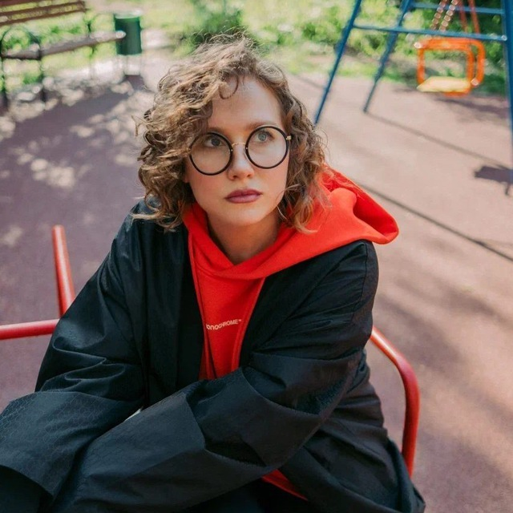
Telegram: https://katya_brus.t.me

---

## Захар
Всем привет! Меня зовут Захар и я продуктовый дизайнер. Интересуюсь AI, Web3, вайб-кодингом и много чем ещё. Нравится узнавать новое, поэтому я здесь. Сейчас стараюсь запустить свой первый пет-проект. Так как у меня нет коммерческого опыта, готов брать на себя небольшие задачи или большие, но под руководством опытного дизайнера. Мои работы можете посмотреть в моём тг-канале. 

Чем могу быть полезен:
Генерация идей 
UI-концепты
Написание текстов (чуть-чуть) 

Буду рад новым знакомствам и совместной работе!

P.S Сейчас в поиске команды мечты, где из меня сделают матёрого дизайнера)

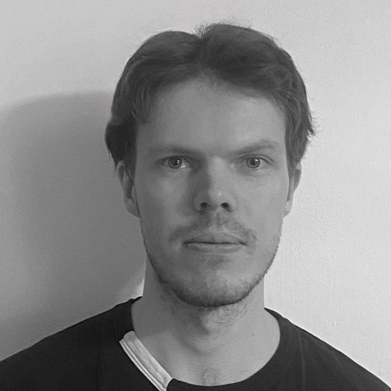
Telegram: https://katya_brus.t.me

---

## Aliaksandra
Привет! Меня зовут Александра, я работаю дизайнером в банке Узбекситана, банк небольшой, поэтому приходится делать много разной работы - от креативов и написания текстов до полноценных flow. Большую часть времени работала с B2B, только сейчас начала работать с B2C, в основном это SaaS, crm-ки, последнее время - мобильный продукт.
Рада познакомиться со всеми и будет здорово, если смогу помочь в работе!

Telegram: https://katya_brus.t.me

---

## Ekaterina Starchenko
привет! я Катя 👋

дизайню финтех продукты, сделала интернет-банк и дизайн-систему в Росбанке, запустила несколько MVP и пилотных фич

люблю, когда вокруг движ и классные люди, интересуюсь AI-инструментами и тем, как они помогают в UX

если могу быть полезна — подключусь с удовольствием 🚀

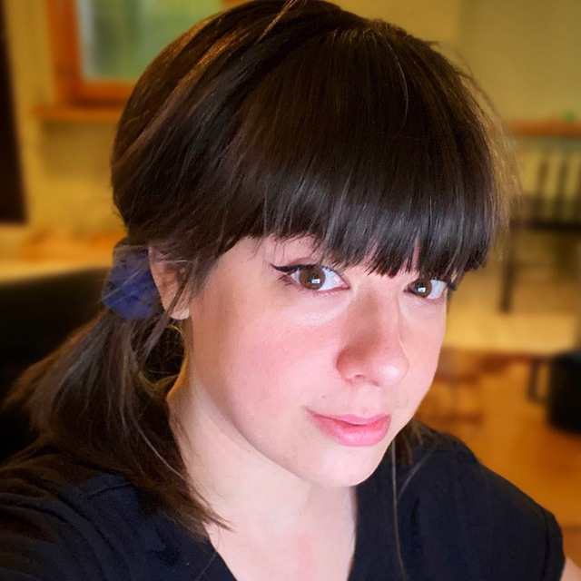
Telegram: https://katya_brus.t.me

---

## Vadim
Привет, дамы и господа!

Я Вадим, я руководитель веб дизайн-системы в Авито.

Свой путь в IT начинал как PHP-разработчик и владелец интернет-магазина косметики, но всегда тянуло к дизайну и веб-разработке.

С 2016 года работаю в Авито, где прошёл путь от продуктового разработчика до руководителя дизайн-системы на вебе:
- начинал в команде монетизации;
- стоял у истоков Авито Доставки;
- вместе с командой дизайна смогли привести дизайн Авито к единому виду и интегрировать его в внутренние продукты компании.

Немного о себе:
- летом по утрам меня можно найти на вейкборде в Строгино;
- Gesh one love 🤘

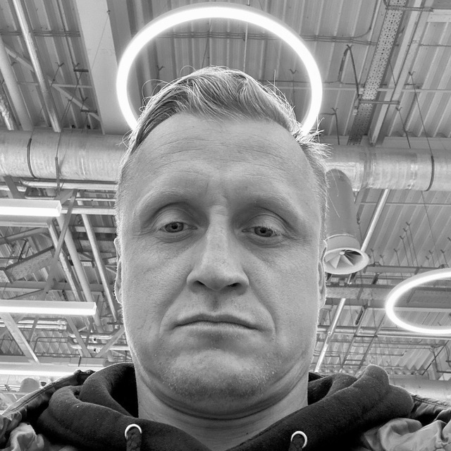
Telegram: https://katya_brus.t.me

---

## Тая
Привет 🤗Меня зовут Тая, я из Казахстана, Алматы. Уже более 11 лет в дизайне. Начинала как графический, а потом нативно занесло в проектирование интерфейсов.

Сейчас работаю в сфере страхования, оркестрирую b2b, b2b2c направления. Ранее творила в стартапах и в разных ERP на машиностроительном заводе. 

Рада быть здесь 🔥

---

## Mariya Tsumenko
Привет, я Маша 
продуктовый дизайнер работаю в e-commerce, финтехе и AI/healthtech.
Работала в Самокате, Мегамаркете, Инсилико и ВТБ.
Занимаюсь разработкой CRM, личных кабинетов, финансовых систем и дизайн-систем.
Провожу UX-исследования, интервью, тесты и применяю подход JTBD

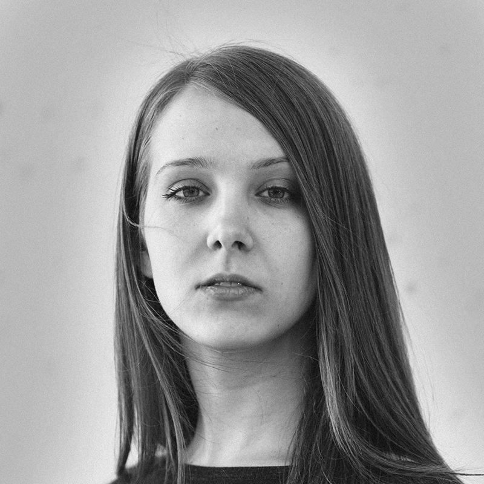

---

## Влад
FoВсем привет!

Меня зовут Влад, более 3-х лет в дизайне. Работал с различными проектами: от е-кома до финтеха. Работал как со стартапами, так и уже с существующими решениями.

В связи с определенными обстоятельствами, опыта конкретно в продуктовых компаниях нет, но есть на аутсорсе. В настоящее время ищу себя в продукте.

Помимо этого, есть 10-летний юридический бекграунд, понимание, почему приходят блокировки по 115-ФЗ, и как банки взаимодействуют с Росфинмониторингом.

Надеюсь, что могу быть полезен☺️

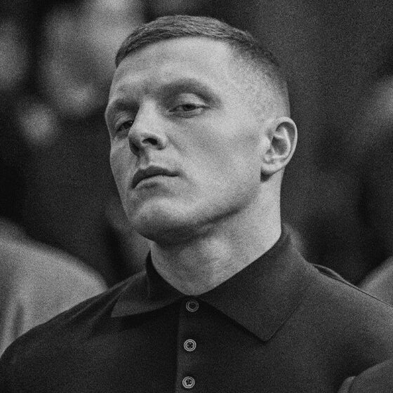

---

## Anton
👋 Привет! 
Я Антон, UI/UX-дизайнер и продакт с 10+ годами опыта в веб-разработке и управлении проектами. 
Из недавнего: 
– продакт-дизайнер в Paybis.com (по продукту работал в основном с корпоративным кабинетом: Corp On/Off Ramp, Crypto Payments, Crypto Payouts, Wallets), 
– до этого ~5 лет руководил проектами в Scada.lv.

Сейчас фокусируюсь на собственном SaaS – визуальной системе аналитики, которая объединяет маркетинг, продажи и прибыль в одном интерфейсе. Хочется сделать простую и полезную для бизнеса аналитику. Яндекс.Метрикой и GA сложно пользоваться. 

Вчера наткнулся на Роллаут – выглядит очень интересно, хочу пока осмотреться.

---

## MAndrei Lynnik
FoundeВсем привет!

Меня зовут Андрей, работаю продуктовым дизайнером в БКС Мир Инвестиций. Участвовал в создании интерфейсов для финансового и медицинского сервисов, портала объявлений и помогал стартапам. В работе люблю решать сложные задачки через понятный UI, изучать новые подходы и оптимизировать рутину.

Еще нравятся дизайн-системы. Даже собрал собственный UI-кит, чтобы быстрее делать проекты, но после знакомства с дизайн-системой крупной компании понимаю, что над ним еще работать и работать.

Рад знакомству и возможности помочь :)

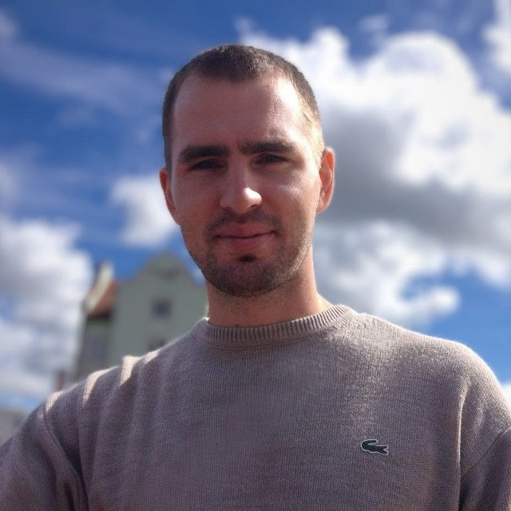

---

## Никита Фомичев
Всех приветствую 👋 

Меня зовут Никита, я UX/UI дизайнер с небольшим, но интересным опытом. Был частью стартапа, в котором с командой мы с нуля реализовывали продукт и участвовали в форумах, спитчах, грантах и т.д. Так же скорешился с владельцем крутой сети кофейнь и делал для них дизайн мобильного приложения.  

Вобщем безумно кайфую от сферы, которой занимаюсь и активно впитываю все новое, что поможет мне расти как специалисту

Поэтому рад стать частью крутого комьюнити и интересного проекта

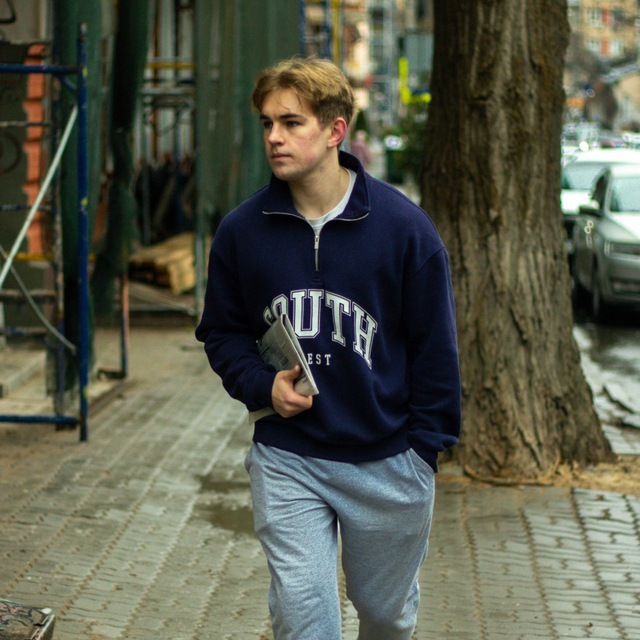

---

## Анна
Привет! Я Аня 👋
Продуктовый дизайнер, работала в Т-Банке над автокредитами – проектировала флоу от заявки до выдачи кредита.

Сейчас учусь на Next Level у Миши Розова, прокачиваю визуал, анимацию и 3D.
Люблю разбираться в сложных сценариях и превращать сухие процессы в понятные, живые интерфейсы.

Могу быть полезна в:
- структурировании флоу и улучшении UX
- создании чистого, выразительного визуала
- формулировке идей и продуктовых концепций

Рада присоединиться 🥰

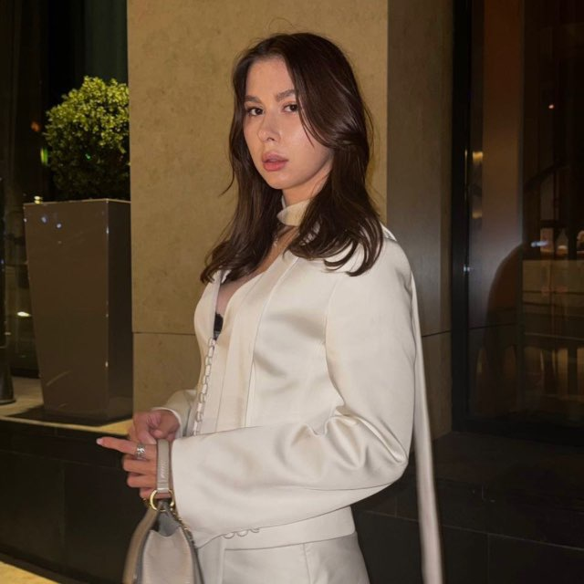

---

## Ruslan Fatixov
Привет!
Я Руслан, я рисую геймификации в Ozon

Локация: Алматы

В дизайне я 11 лет. Начинал от моушн-дизайна, оттуда в графический дизайн оттуда в веб и в дизайн интерфейсов.

Последний год реализовываю свои пет-проекты Благодаря развитию ИИ могу сделать свои концепты веб-сервисов. Практикую навыки дизайна интерфейсов в стартапах и некомерческих проектах.

Хобби:
- Велоспорт
- Маппинг в OSM

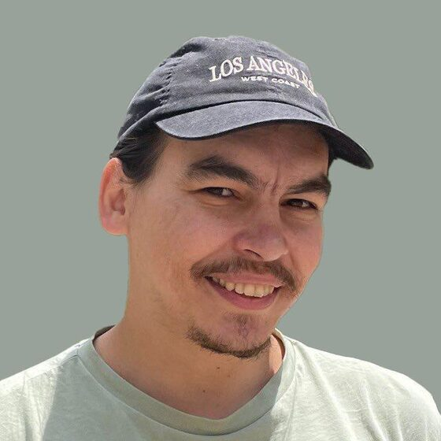

---

## Марина
Привет!
Я Марина, дизайнер дизайн-систем

В профессии 4 года
Работала в продукте, оттуда плавно перешла в системы
Буду рада быть полезной!

Живу в Питере
Умею стоять на руках 🤸‍♂️

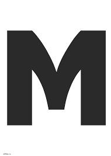

---

## Сергей
FoundeВсем привет!

Я Сергей 🙂
Делаю продукты в сфере кибербезопасности на рынках РФ и Казахстана.
Отвечаю за весь цикл от гипотез и исследований до релиза и улучшения пользовательского опыта.

Сейчас прокачиваю UX-флоу и продуктовые сценарии, глубоко копаюсь в инсайтах пользователей и рынке.

Рад присоединиться ✌

---

## Nastya
Всем привет!
Я Настя, опыт в дизайне 3+ года
Работала в студии, стажировалась в яндексе) Делала в основном личные кабинеты, CRM системы. Здесь хочу получить опыт, внести свой вклад и быть рядом с увлеченными дизайном людьми 🥰

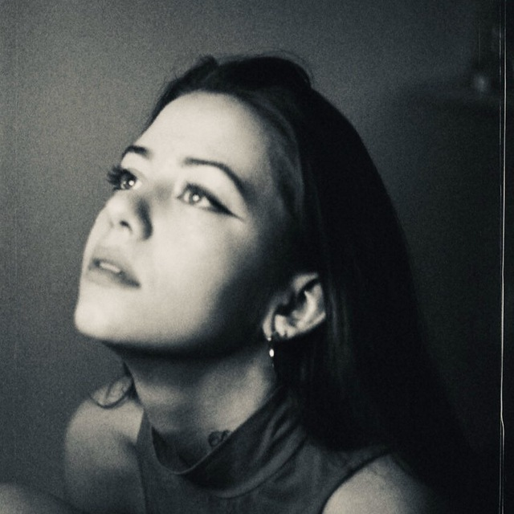

---

## Карина
Founder & Art DirectorПривет!
Я Карина, занимаюсь UX/UI дизайном около 2х лет. Люблю создавать удобные и эстетичные интерфейсы. В поиске интересных проектов и команды, где можно прокачать навыки и получить крутой опыт 👩🏼‍💻

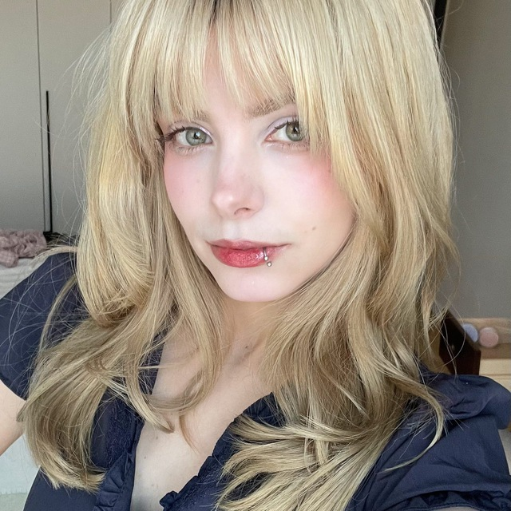

---

## George Shchepkin
Всем привет! 🙂

Зовут Георгий, UX/UI дизайнер, пока что с небольшим опытом. Сейчас тружусь в стартапе, где с нуля выстроил все процессы методом проб и ошибок, ну и немного фриланса конечно. Хотелось юы побольше продуктового опыта получить, ну и развиваться в этом направлении соответственно.

Скроля различные вакансии наткнулся на проект, загорелся возможность пообщаться с новыми людьми и переманить их опыт себе, ну и конечно же — получить позитивные эмоции!😁

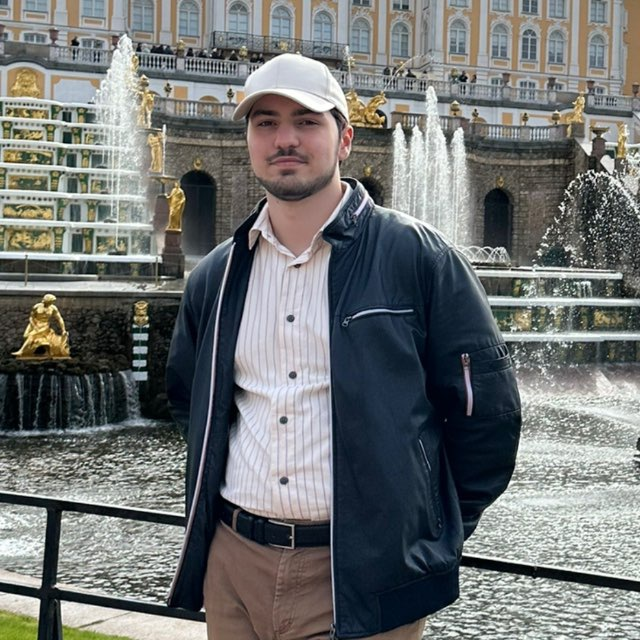

---

## Vladislav Shved
Всем привет!

Я Влад, продуктовый дезигнер. В дизайне около трёх с половинкой лет. Начинал работу в компании комитет (площадки vc.ru, dtf). И немного до этого занимался фрилансом. Сейчас работаю в банке ВТБ. Пилю как внутрянку, так и продукты для клиентов банка ВТБ.

Сейчас активно изучаю 3D и моушн дизайн. Потом хочу сам в проектах пилить крутые 3дэхи и анимации.

Рад присоединиться к комьюнити

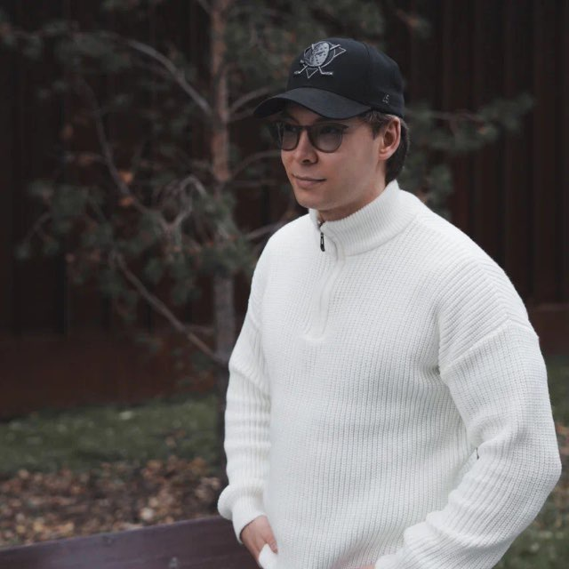

---

## Алёна
Всем привет! Я Алёна, в дизайне уже около 2 лет.

Работала в студии, делала интерфейсы - от небольших сайтов до сервисов с более сложной логикой. Сейчас двигаюсь в продуктовый дизайн, изучаю исследования и продуктовый подход.

Рада присоединиться 😊

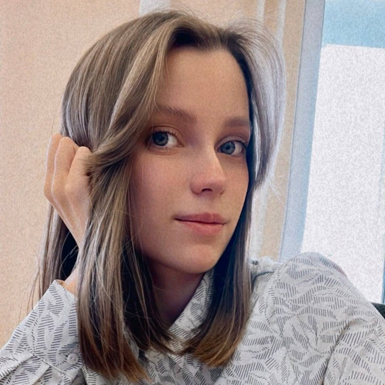

---

## Ksenia Yusubova
Всем привет 👋
Я продуктовый дизайнер с коммуникационным бэкграундом и опытом 4+ лет.
Начинала в стартапе, команда которого создавала метавселенную Numi — занималась визуалом для соцсетей, e-mail-рассылками и мерчем.
Позже работала UI/UX-дизайнером в венчурной студии: среди проектов были интернет-магазин алмазов и бриллиантов, криптоплатформа для мониторинга подозрительных операций, криптокошелёк и сервис наподобие profi.ru, но для юридических лиц.
Сейчас — продуктовый дизайнер в студии, ориентированной на западный и европейский рынок. Занимаюсь высоконагруженными продуктами.
Буду рада познакомиться, пообщаться и, возможно, быть полезной в самых разных задачах. Всегда ценила возможность работать с сильными специалистами — надеюсь, что и здесь получится завести классные профессиональные связи. 🙌

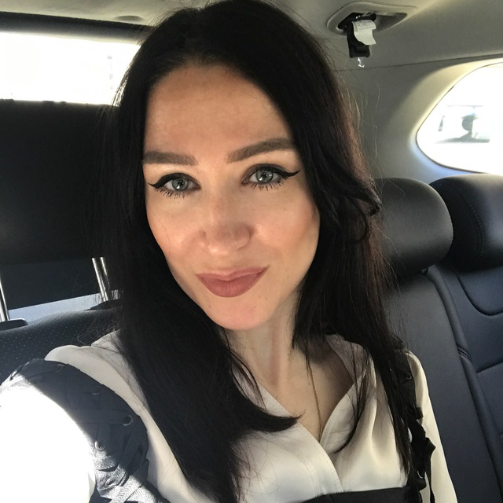

---

## Nika
Привет! Меня зовут Ника, я в дизайне более 4 лет
Училась на графе, но потом перешла в веб и интерфейсы, сейчас работаю в агентстве, собираю с нуля в основном огромные корпоративные сайты и интернет-магазины, иногда работаю с сервисами и crm
Буду рада новым знакомствам, опыту и интересным задачам ✌🏼

Еще обучаюсь motion и нейросеткам, с нетерпением жду открытия горнолыжного сезона🥺

Рада присоединиться!

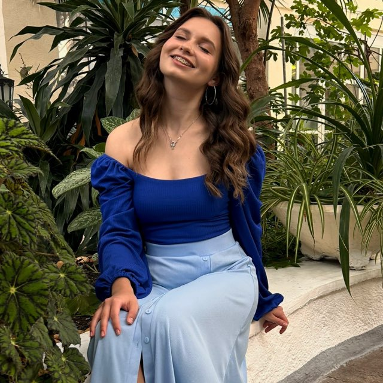

---

## София
Привет! Меня зовут София. Я ux/ui дизайнер из Санкт-Петербурга. Сейчас занимаюсь самообучением и обновляю портфолио. Так как у меня нет коммерческого опыта, готова брать на себя небольшие задачи. Решила выходить из зоны комфорта и пробую вести свой  тг-канал

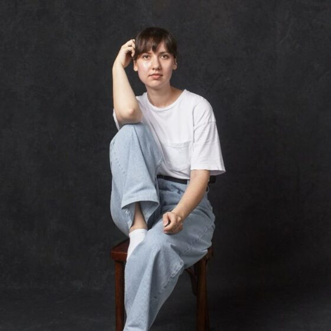

---

## Игорь
Привет! Я Игорь, в дизайне 2 года.
Работал на фрилансе с разными компаниями: от заводов до магазинов косметики.
На данный момент работаю в студии MAX.

Рад знакомству)

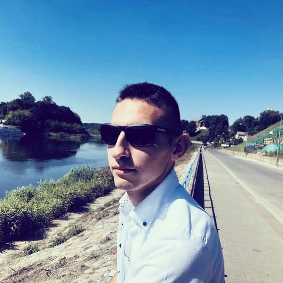

---

## Арина
Привет! Я Арина :) UI/UX > Продуктовый дизайн. За плечами куча разного опыта, от стройки и ремонта (гилти плежер вне работы) до ассесабилити в интерфейсах. Обожаю продумывать как воплотить что-то в жизнь, что бы было удобно, красиво и не сожрало все ресурсы 😂

---

## Илья
Всем привет. Меня зовут Илья, я UX/UI дизайнер. Работал со стартапами и многими другими проектами 👐

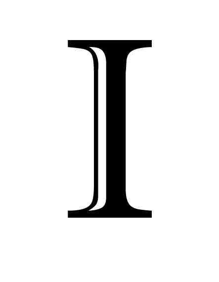

---

## Тали
FoundeВсем привет! Я Тали, продуктовый дизайнер.

Последние 3 года помимо проектирования app и web интерфейсов была еще и бизнес аналитиком.

Разрабатываю с нуля сложные интерфейсы, прописываю логику и алгоритмы внутри приложения, провожу тесты и пишу на все это ТЗ для разработки. А потом проверяю 😈

Имею большую экспертизу в областях: dating, health, mental health, chat bots, создание и развитие продуктов, ориентированных на живое общение между пользователем пользователями; применение AI технологий для модерации контента

Буду рада если мои знания пригодятся, также классно было бы обменяться опытом

https://www.linkedin.com/in/iamtali

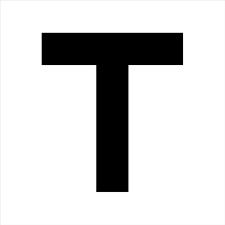

---

## Анна Коваль
Тоже поздороваюсь)
Всем привет) я Аня, продуктовый дизайнер, ваще ниче особенного, но рада быть в крутой команде)

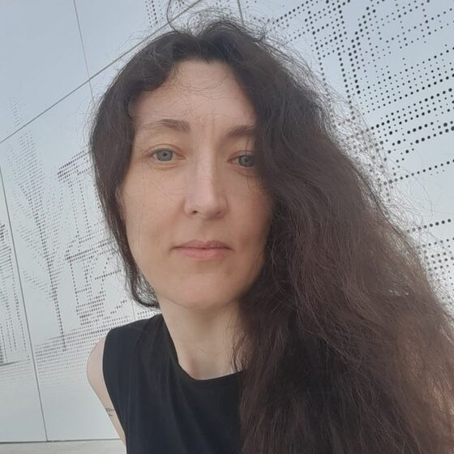

---

## Julia
Всем привет! Меня зовут Юля

Я дизайнер, который работает на стыке брендинга и интерфейсов, что значит на стыке: не отпускает графика и оч интересны интерфейсы, поэтому пока учусь и практикуюсь в интерфейсах, но всё также беру что-то уже более интересное и осмысленное из айдентики, упаковки или мерча, что по кайфу в общем) параллельно строим с мужем коммуникационное агентство

Недавно я работала в самокате. Уволилась. Сейчас без основной работы, работаю только проектно и осваиваю новую для себя специфику. В целом, в последнее время занималась визуальной айдентикой, упаковкой, широкоформаткой и мерчом для брендов и продуктов — от концепции до внедрения. Сейчас оч хочется развиваться в продуктовой стороне дизайна: исследовать пользователей, проектировать интерфейсы и собирать прототипы

Люблю системность, понятные визуальные решения и когда дизайн реально работает на пользователя, в том числе в графическом дизайне

Буду рада общению и обмену опытом 🤍

https://www.linkedin.com/in/julia-fedorischeva-964531126/

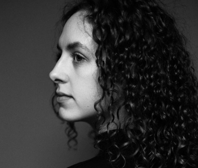

---

## Карлен
Всем привет! Меня зовут Карлен

Я UI/UX Продуктовый дизайнер. Работал в Ддос-Гвард и немного с ВКтех. Сеньор мемолог)

Сейчас без работы, поэтому буду помогать всем чем могу)

Буду рад новым знакомствам и совместной работе!

Мое портфолио - karutyunyan.ru

---

## Anna Ovsienko
Привет привет! Меня зовут Аня.
Я UX/UI дизайнер уже около 5и лет, в основном над сложными высоконагруженными интерфейсами Saas, B2B, CRM.
Хотелось бы набрать больше продуктового опыта и опыта в исследованиях.

Буду рада присоединиться к вашей команде

мое портфолио
https://wenicks.notion.site/287d556dfdcc818bb851c6e1263737dd

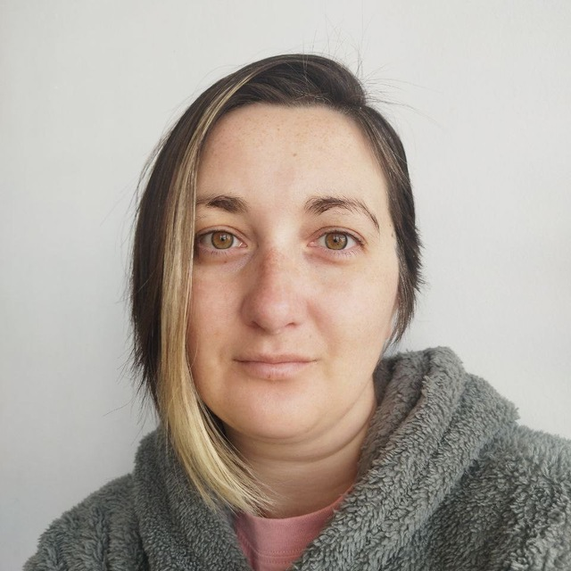

---

## Darya Lapitskaya
Всем привет, я Даша.
В дизайне около 4 лет, большую часть из которых работала в финтехе. Несколько лет развивала внутренний продукт для команды антифрода, финансистов и операционистов. Сейчас занимаюсь HR-инструментами для сотрудников. Рада познакомиться 😊

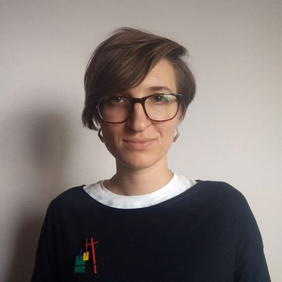

---

## Timur Hasanov
Здравствуйте! Меня зовут Тимур, я из Узбекистана. Основной опыт у меня связан с Upwork — участвовал более чем в 10 проектах с клиентами из США, Канады, Китая, Германии и других стран. Сейчас работаю в крупной локальной компании, где занимаюсь в основном сложными и масштабными системами.

Иногда мои работы получаются красивыми, но немного беспорядочными. Также не до конца систематизированы портфолио и документация. От проекта хочу научиться всё упорядочивать и повысить шансы устроиться в крупные компании или дизайн-агентства.

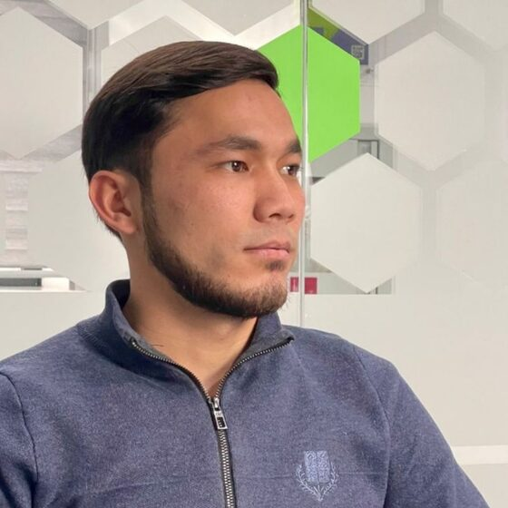

---

## Евгений Ившин
Всем привет! Я Евегний. Мы делаем небольшой продукт - создание цифровых двойников бумажных архивов в закрытом контуре. Работаем с ML: распознаем и структурируем много текста, улучшаем качество сканов, сохраняем наследние)

Среди клиентов, как небольшие гос клиенты, так и крупный бизнес)

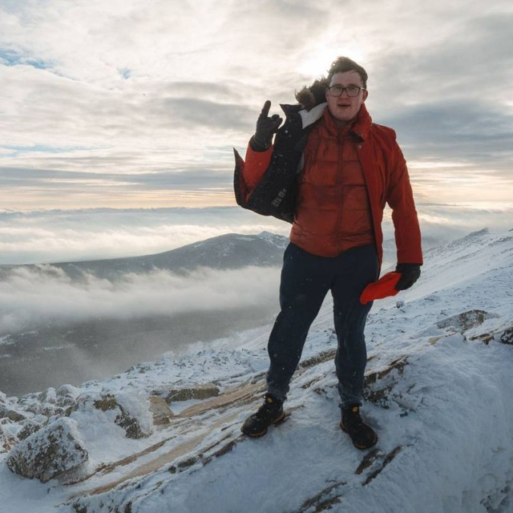

---

## Анна
Всем привет!
Меня зовут Аня, я продуктовой дизайнер. В сфере относительно недавно, но уже успела поработать над продуктами РСХБ. В свободное время создаю постеры, развиваюсь в ux-исследованиях. Делюсь своим портфолио. Рада знакомству!😊

---

## Pavel Sirota
Привет!

Я лид продукта для селлеров в маркетплейсе Flowwow и ревьюер в практикуме. До этого долгое время работал продуктовым дизайнером в разных продуктах — апки для бизнес юзеров, таймтрекер, админки, CRM, игры, криптобиржа

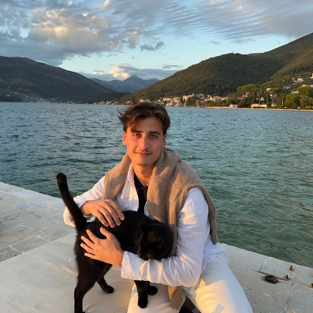

---

## Polya
Всем привет! 👋

Меня зовут Полина, в дизайне уже больше 2-х лет. Среди проектов как веб-продукты, так и мобильные приложения. Из гордостей - с нуля спроектировала mvp фитнес приложения 💪

Рада присоединиться к команде и вместе развивать Роллаут с увлеченными людьми😊

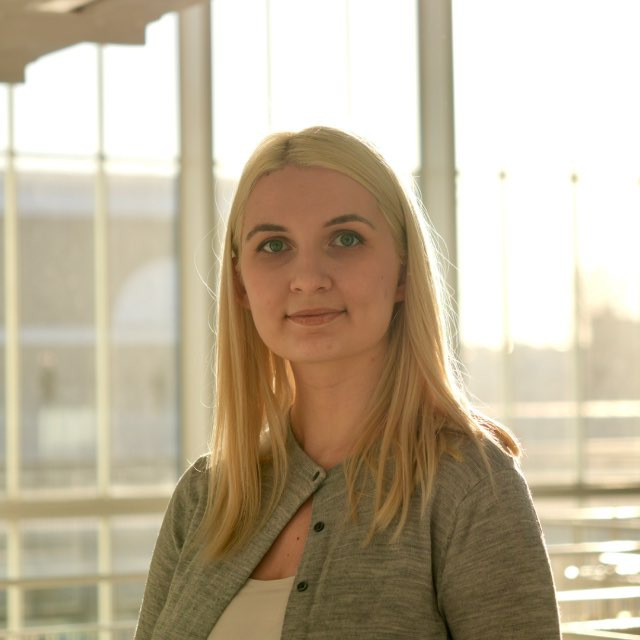

---

## Ксения
Всем привет! 👋
Меня зовут Ксения и я начинающий UI/UX дизайнер.
Раньше работала в сфере образования и аналитики, а сейчас изучаю интерфейсы, пользовательский опыт и учусь превращать идеи в понятные визуальные решения.
Очень интересно поработать в команде над общим продуктом, обменяться опытом и прокачать навыки.
Рада знакомству и сотрудничеству ✨

Мой линкед: https://www.linkedin.com/in/ksenia-koimova-9b2913266/
Портфолио: https://www.behance.net/22ce57b9

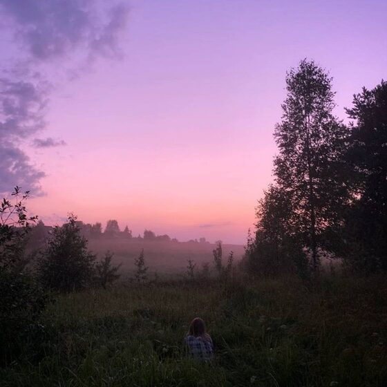

---

## Марина
Всем привет,

меня зовут Марина и я рада присоединиться к команде Ролаута.

Начинала, как графический дизайнер, дизайнер упаковок, руководила своей командой, потом я сменила место жительства и решила что хочу делать цифровые продукты, пошла учиться к Розову, сейчас занимаюсь в основном вебом, и набиваю первые шишки в создании приложения. Более 5 лет я работаю, как единственный дизайнер в командах. Очень хочется поработать над большим проектом, и вот я здесь)

---

## Мария
FounВсем привет!
Я Маша, продуктовый дизайнер, работала Тбанке в Т-возврате, а сейчас дизайню в сервисе по подбору психологов Альтер. Если кому-то хочется законнектиться, вот мой Линкедин и Портфолио :)

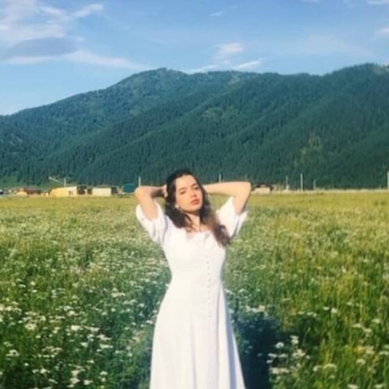

---

## Marina Levitina
Всем привет!
Меня зовут Марина, я UXUI дизайнер, переехала 4 года назад из Екатеринбурга в центр Израиля. Пару лет назад открыла ИП и работаю дизайнером на Upwork, т.к. очень сложно попасть в найм.

Очень рада присоединиться к команде, познакомиться с финтехом и помочь чем смогу 😌
Делюсь Линкедином и портфолио 🙌

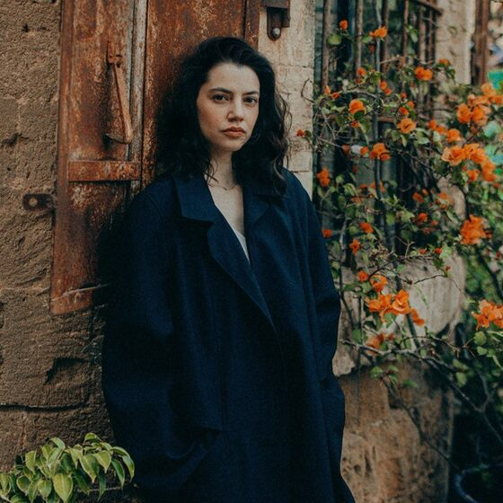

---

## Lena
Привет! Я Лена, UX/UI дизайнер. Работаю в айтсорс компании, опыт в дизайне – более 2 лет. Хочу больше развиваться в сторону продуктового дизайна.

Рада присоединиться к вашему комьюнити) В ближайшие дни планирую погрузиться в изучение того, что уже сделано и надеюсь, что в дальнейшем смогу быть также полезной)

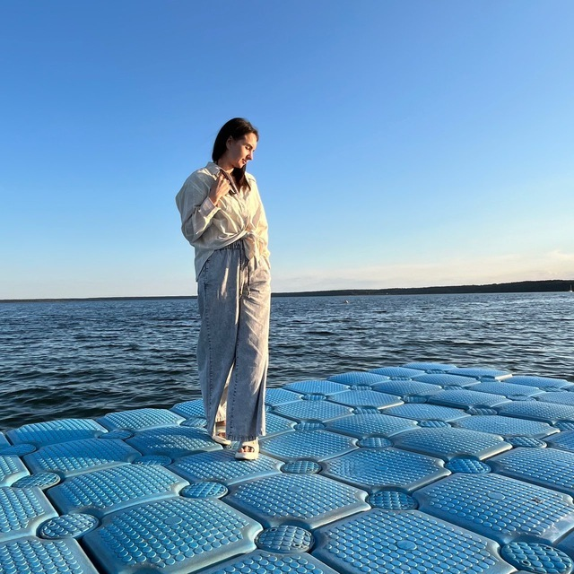

---

## Anastasiia Abramova
Всем привет! Меня зовут Настя.

По образованию я архитектор-градостроитель и раньше работала в этой сфере. Также обучалась и немного занималась графическим дизайном. Но поняла, что хочу развиваться в продуктовом дизайне — сейчас активно учусь и прокачиваю навыки.

Очень рада присоединиться к команде Роллаута, чтобы получить опыт, пообщаться с профессионалами и, конечно, быть полезной проекту 🙏🏼

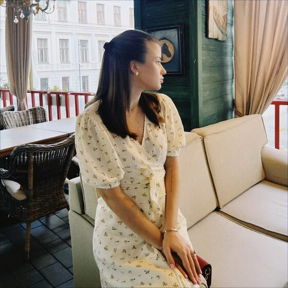

---

## Julie
всем привет!
меня зовут Юля.
в сфере ux/ui и продуктового дизайна около 4 лет, начинала с фриланса, затем уже вошла в проекты/компании.
в основном специализируюсь на разработке высоконагруженных дашбордов/crm b2b, b2b2c saas, сферы интересов edtech/healthtech/saas/fintech как вектор развития.

очень не хватает фидбека от старших дизайнеров, тк увы в основном работаю как один дизайнер.
также надеюсь, что получится добавить продуктовый кейс в портфолио, тк сейчас в процессе откликов на зарубежные вакансии продуктового дизайнера (целюсь на middle)

из необычного: территориально сейчас в сша, тк поступила на магистратуру сюда, НО желания заканчивать ее нет, тк ожидания от программы не совпали с реальностью, поэтому есть доп стимул для поиска работы worldwide 🥹

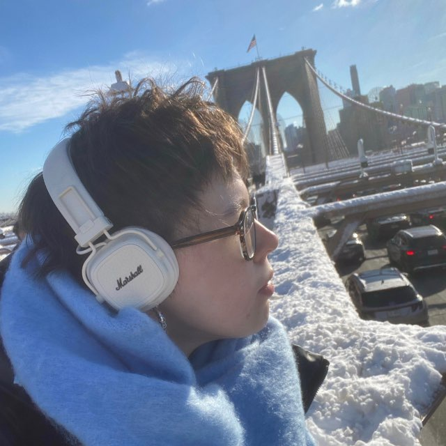

---

## Artyom Rusakov
Привет!
Я тут новенький, так что хочу представиться!

Я Артём, дизайнер интерфейсов. Уже три с чем-то года работаю на аутсорс компанию, делаем всякие разные торговые приложения (от терминалов для супер профи до мобилок для тех, кто только начал торговать). Благодаря такому опыту, плотность данных — моё всё (иногда бью себя по рукам за это). Помимо основной работы изредка балуюсь над своим петпроектом (он пока не вышел, разумеется 🥲)

Пришёл в Роллаут, в первую очередь, за коммьюнити крутых дизайнеров, работая с которыми буду расти. Ещё чтобы перепрошиться на настоящий продуктовый подход (а то в аутсорсе до всего интересного почти не дотягиваемся) + буду пользоваться каждой возможностью прокачать визуал

Очень рад оказаться тут, со всеми супер рад буду познакомиться!
А если кто-то собирает коннекшены в линке, то давайте, собственно, коннектиться! Клик-тык-клац

---

## Натали
Привет!
Меня зовут Наташа. Я продуктовый дизайнер, более 3х лет создаю цифровые продукты на web и mobile платформах. Есть опыт работы на фрилансе, в студии и в продуктовой команде.
Умею: дизайн-системы, UX-исследования, нейронки.
Сейчас в поиске продуктовой компании, в которой я смогу применить свой опыт.
От Роллаута ожидаю: крутого комьюнити, работы над интересными задачами, новых знакомств, обмена опытом и новых кейсов для портфолио. Хочу набрать больше продуктового опыта)

Портфолио: https://www.behance.net/natalyakozhemi
LinkedIn: https://www.linkedin.com/in/nataly-kozhemiako-b02b5b116/

Буду рада новым знакомствам и совместной работе😊

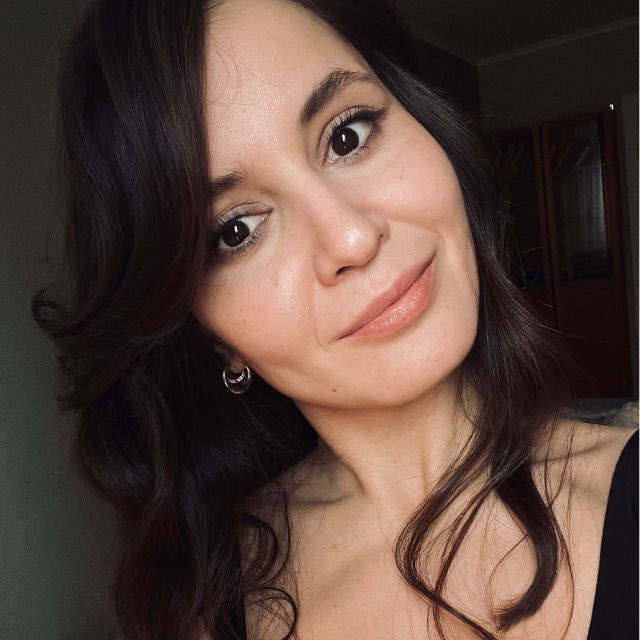

---

## Vitaliy
Приветствую ! Меня зовут Виталий. Занимаюсь электроникой , проектированием железа ! Интересно посмотреть на ваш проект чем занимаются в этой области !

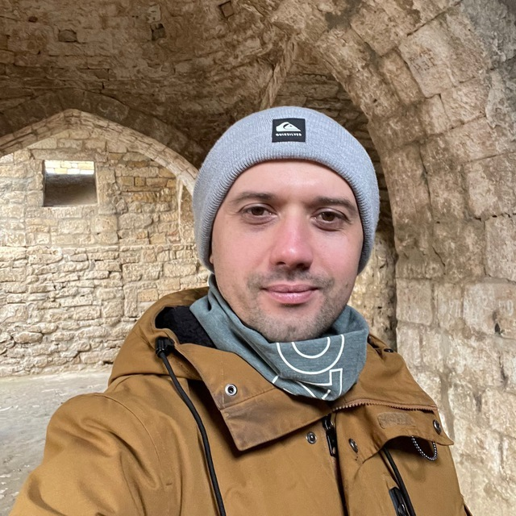

---

## Саша
Ребят, всем хай! Когда подключился к проекту, так и не оставил сообщения, а людей всё больше и больше набралось, хочу задним числом!

Меня зовут Саша, я двигаю пиксели в Маце, до этого работал в Роджо, Арке и Прагматике. В проект вписался делать ветку с логотипами — идея собрать его жила со мной уже как года три-четыре, было несколько подходов, но только в этом году звёзды сошлись и всё заработало. В следующем хочу его ещё подтюнить

Я за любой движ, так что если хотите что-то сообразить/порисовать/etc., то зовите. А если вы подпишетесь на мой канал @designstock404, то я буду без ума от вас и поверю в новогоднее чудо. Там чуть детальнее рассказал, как мысль с сайтом родилась вообще 🥹

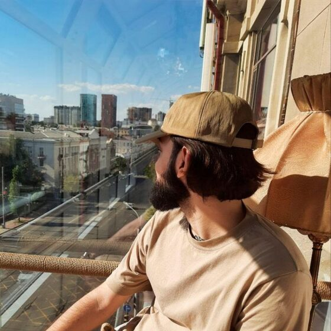

---

## Mark Sochnyy
Всем привет!

Я Марк, продуктовый дизайнер с опытом 3 года
Работал над проектами B2B (Яндекс Логистика), SaaS, E-commerce, Service Design
Текущее место работы — студия «Луч» 

Рад знакомству! ⚡️

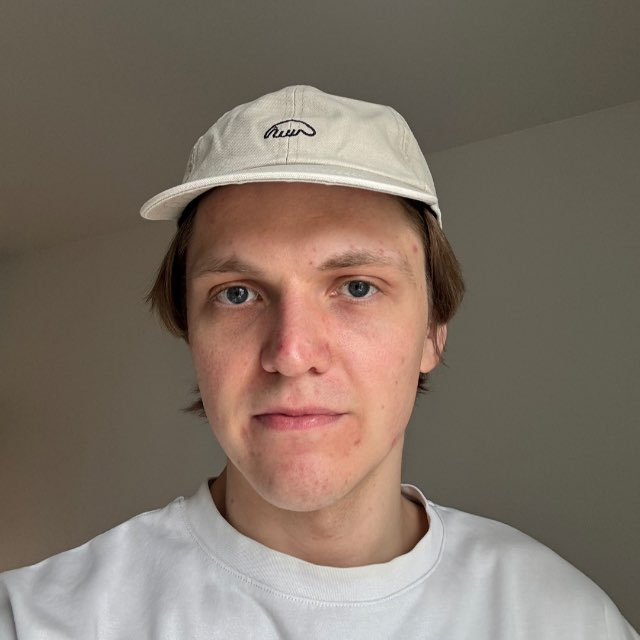

---

## Снежана Соколова
Всем привет, меня зовут Снежана! Рада быть с вами)
Я UI/UX дизайнер с продуктовым подходом. 4 года работала в дизайн-студии, на большом производственном потоке) в итоге поняла, что хочу развиваться в продукте, глубже погружаться в проект.
Очень нравится думать не только исследованиями, а еще психологическими паттернами, как управлять вниманием, какие триггеры работают и тд) также работать с мотивацией, геймификацией, так как сама такое оч люблю)
Сейчас учусь, прокачиваю портфолио, ищу работу)
Люблю думать, анализировать, придумывать стратегию, создавать хорошую юишку!
Очень хочется обменяться опытом, поработать вместе над интересным проектом, познакомиться)

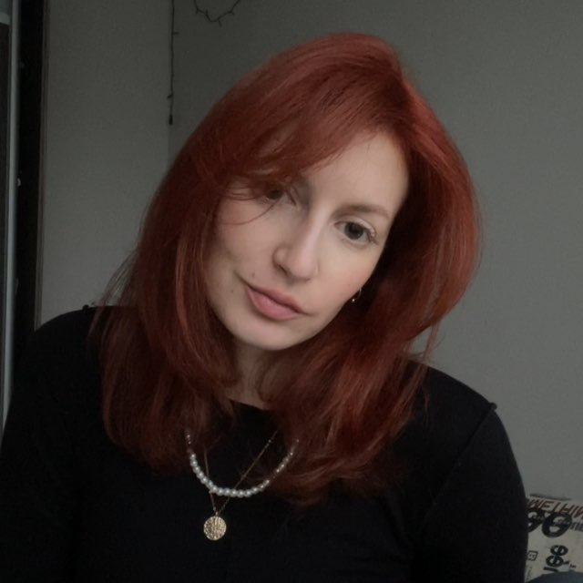

---

## Лёва
Привет-привет!

Я Лёва, продуктовый лид в Прагматике, сейчас выращиваю юнит цифрового дизайна. Получаю деньги за дизайн лет 7-8 уже. Работал в Правительстве СПб, Газпром-нефти, билайне, немного с Додо и кучей финтеха в последнее время в Прагматике.

Помимо всего очевидного, могу быть полезен тем что пишу код и постоянно мастерю всякие инструментики с AI и без него.

Как-то так вышло что в последнее время довольно глубоко влез в тему оупен банкинга, цифрового рубля и других вызовов времени. Хочу контрибьютить в Роллаут по мере сил и времени, суперская штука тут делается..

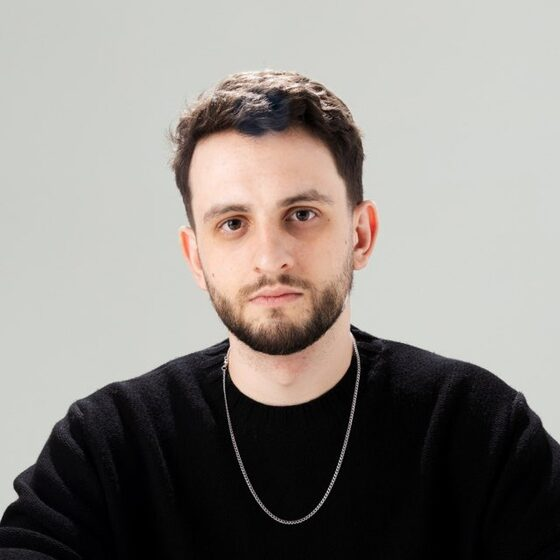

---

## Alina Khristoliubova
Всем привет 👋🏻 
Меня зовут Алина. Дизайнер с небольшим опытом (1,5 года). Работала на фрилансе – создание/редизайн лендингов, так же проходила стажировку в продуктовой компании Цифра, где собирала прототипы, проверяла и создавала компоненты для дизайн-системы и документацию для разработчиков. На данный момент прокачиваю юайку с ментором.
Рада присоединиться к команде, принести пользу проекту и получить бесценный опыт 🫰🏻

---

## Лиза
Всем привет! 👋
Я тут новенькая и хочу представиться. Меня зовут Лиза, я продуктовый дизайнер с опытом 3 года. Сейчас работаю в продукте с data-heavy интерфейсами и дашбордами, до этого была на фрилансе.

Пришла в команду за обменом опытом, ростом, новыми знакомствами и возможностью поучаствовать в реально полезном опенсорс-проекте. Буду рада познакомиться и поработать вместе 🚀

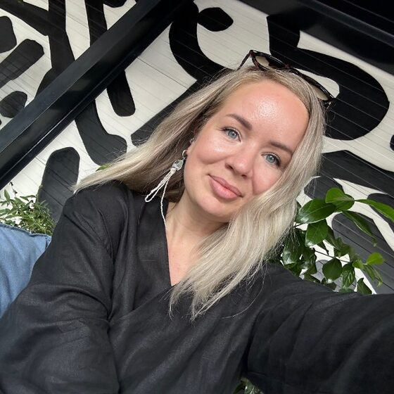

---

## Карина
Приветики! Меня зовут Карина, у меня опыт 4 года в продуктовом дизайне, сейчас работаю в вайлдберис. Ранее работала в банке, есть опыт в финтехе 

Буду рада познакомиться и поработать вместе! 🤓💟

---

## Ksenia
Всем привет! 👋

Я Ксюша, продуктовый дизайнер с опытом 3 года, в основном работаю с B2B-продуктами.  Люблю логику, структуру и понятные интерфейсы.

Рада знакомству и совместной работе!

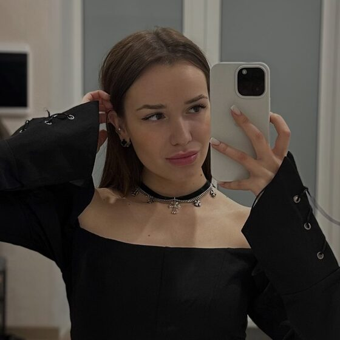

---

## Игорь
Всем привет! Меня зовут Игорь, ux/ui дизайнер.
Буду рад познакомиться и поработать вместе.

---

## Евгений Мололкин
Всем привет.

Меня зовут Женя. Я ux/ui дизайнер. Сейчас работаю в b2b и немного фрилансю) есть различный опыт.

Буду рад знакомствам и участию в проекте.

---

## Николай Щербатенко
Всем привет! 👋

Я Коля, продакт уже 6+ лет, работал с продуктами в разных доменах (HRTech, MedTech, EdTech),

Обожаю исследования и RnD, идеи на метриках и быстрые MVP, когда можно быстро проверить и не развозить.⚡️

Сейчас продакт лид в FinTech: делаю Daily Banking и ищу, где AI и LLM реально могут усилить ежедневный опыт — снять рутину, помочь с контекстом и довести до действия внутри банка 🚀

Вне работы обожаю винил и баскетбол, и в этом году готовлю себя к брикс-тройке марафонов 🏃‍♂️

Буду рад познакомиться и пообщаться!

---

## Николай Щербатенко
Всем привет! 👋

Я Коля, продакт уже 6+ лет, работал с продуктами в разных доменах (HRTech, MedTech, EdTech),

Обожаю исследования и RnD, идеи на метриках и быстрые MVP, когда можно быстро проверить и не развозить.⚡️

Сейчас продакт лид в FinTech: делаю Daily Banking и ищу, где AI и LLM реально могут усилить ежедневный опыт — снять рутину, помочь с контекстом и довести до действия внутри банка 🚀

Вне работы обожаю винил и баскетбол, и в этом году готовлю себя к брикс-тройке марафонов 🏃‍♂️

Буду рад познакомиться и пообщаться!

---

## Аня Можаева
Всем привет)

Я Аня, продуктовый маркетолог в b2b, сейчас занимаюсь SaaS-сервисом для автоматизации финансов бизнеса

Моя зона ответственности обширная — от позиционирования и воронки до ключевых бизнес-метрик (LTV, CAC, C1, retention)

Надеюсь, буду полезна)

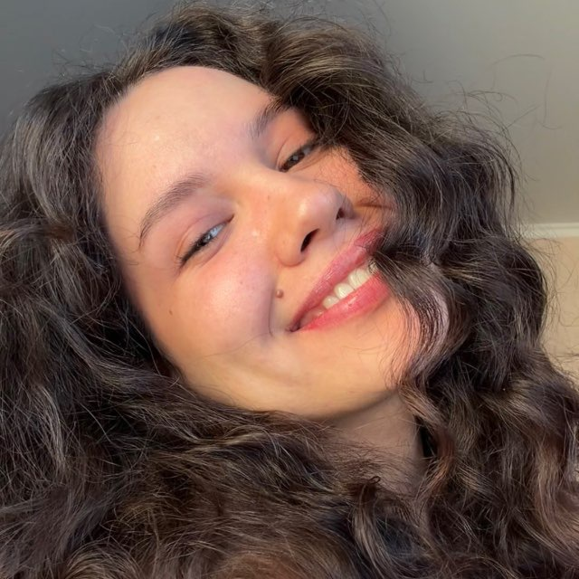

---

## Вадим
Всем привет. Я Вадим. Артдир и продуктовый дизайнер с агентским опытом. Начинал в дизайне еще когда главными инструментами были PageMaker и CorelDraw. Сейчас занимаюсь проработкой ux и ui в различных b2b и b2c проектах, и настройкой процессов в командах. Очень вдохновляет идея проекта и комьюнити, которое тут собралось.

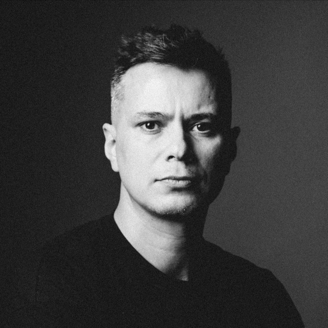

---

## Глеб Данилов
Всем привет)

Я Глеб, ux/ui дизайнер с 3 годами опыта. Работал над корпоративным порталом, тревелтех стартапом и геохимическим проектом.

Рад познакомиться и возможности поработать вместе!

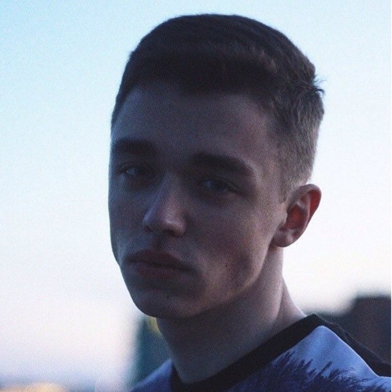

---

## Анна Малинина
привет! 👋

я продуктовый дизайнер. работаю в b2b в кибербезе. кроме проектирования сценариев люблю дизайн системы)

буду рада помочь по возможности )

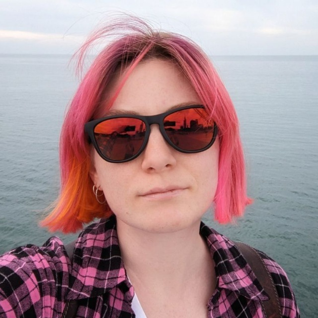

---

## Маша
Все привет!)

Меня зовут Маша, я UI/UX дизайнер, опыт у меня небольшой, около 1.5 года. За это время я успела поработать над такими продуктами, как внутренние сервисы для сотрудников JTI и финтех приложение для выставление счетов. Очень нравится работать именно с высоконагруженными интерфейсами.

Буду рада присоединиться к Вашей команде)

---

## Юля
Всем привет! 🍀
Меня зовут Юля) Я графический дизайнер по образованию. Имею 3 года опыта работы в gamedev разработке анимаций для мобильных игр. Сейчас осваиваю motion дизайн и прохожу курсы по продуктовому дизайну от школы Form Factor.
Сейчас главной задачей ставлю уйти в продуктовый дизайн и освоить сложные анимации для реализации крутых проектов.

Здесь хочу следить за развитием проекта (поучавствовать и внести что-то новое своё) а также познакомиться с вами по ближе и найти общие точки соприкосновения)!

P.S. Расскажу немного про себя: Я родилась и жила в Крыму, 6 лет назад переехала в Тольятти по учёбе и сейчас работаю в офисе компании которая разрабатывает мобильные игры и утилиты. В этом году хочу переехать в Питер и найти хорошее комьюнити) Обожаю и вдохновляюсь Азиатской культурой как в работе так и в жизни.

Буду рада новым знакомствам!💫

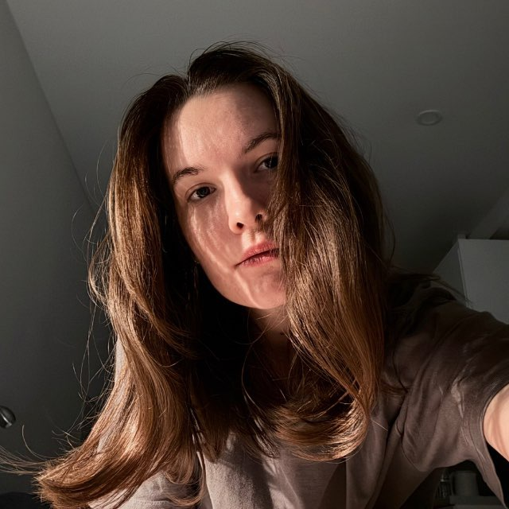

---

## Shamil
Привет! Меня зовут Шамиль, я продуктовый дизайнер с опытом работы в финтехе и крупных IT-командах.
Последние несколько лет занимаюсь сложными интерфейсами: внутренние сервисы, админки, hr-порталы, B2B-продукты.
Работал в Тинькофф, Сбертехе, сейчас — ведущий дизайнер в ГПБ.ТЕХ. Параллельно участвовал в B2C и B2B стартапах.

Рад знакомству🤜🤛

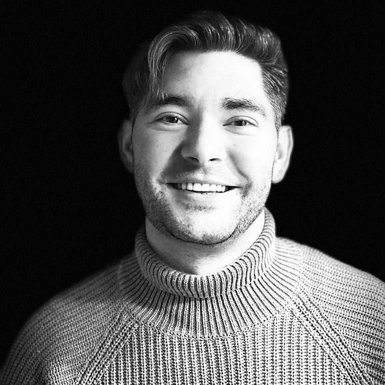

---

## Max Holden
Привет! Я Даша Егорова)

Дизайн-директор по UI/UX в студии ЦЕХ @tsekh_design
Приходите мы там интересное пишем)

ex. Дизайн-директор Mish отвечала за продуктовое направление и исследования.

До этого 6 лет работала в компании МТС. Что хорошего успела сделать: формировала UX-стратегию для компании МТС, была арт-директором B2B направления, сформировала концепцию Музея компании, запустила направление коммерческого мерча, участвовала в создании фильма «Дизайн — это глагол» 

Писала и продолжаю писть курсы и статьи) С Мишей познакомились по работе) Поэтому я оказалась тут очень интересно)

Ко мне можно обращаться: по поводу дизайна, дизайн-стратегий, выступлений (люблю выступать и гостей в студии принимать). Ну и в целом я всегда открыта к нетворкингу.

Да, у меня и канал есть)
@dsgnlove

рада знакомству)

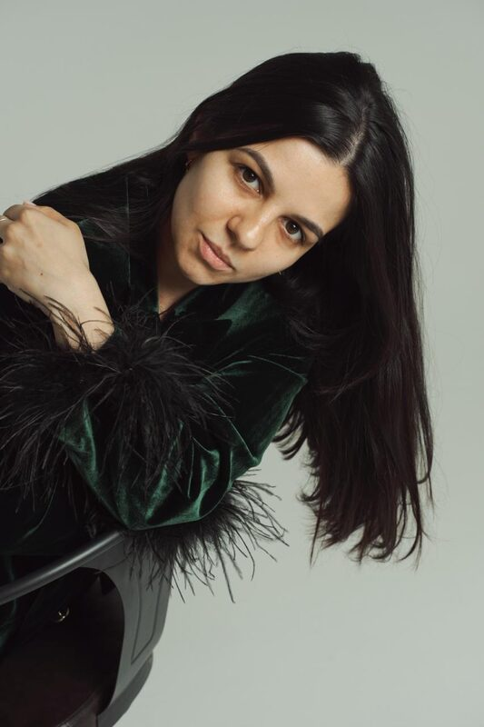

---

## Елизавета Полторацкая
Founder & Art DirectorВсем привет!

Меня зовут Лиза. У меня за плечами опыт работы бизнес-аналитиком/ПМ-ом в финтехах — МТС-Банке, Яндексе и Ozon Банке. Я успела позаниматься построением процессов привлечения клиентов в B2B-продукты, развитием внутренней платформы для сотрудников. Сейчас мне особенно интересно изучать пользовательский опыт в различных приложениях.

Буду рада познакомиться со всеми и поделиться опытом!

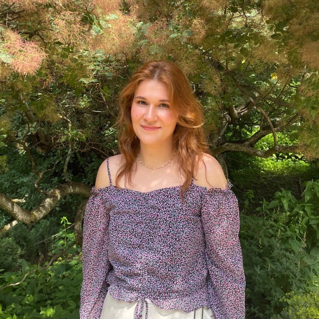

---

## Крис Толстых
Всем привет!

Я Кристина, коммерческий директор Mish. Рада присоединиться и познакомиться с вами.

Вне работы - 25 лет катаюсь на сноуборде и увлекаюсь бёрдвотчингом, люблю наблюдать и находить интересное в деталях. Открыта к общению, обмену опытом и новым контактам. ❤

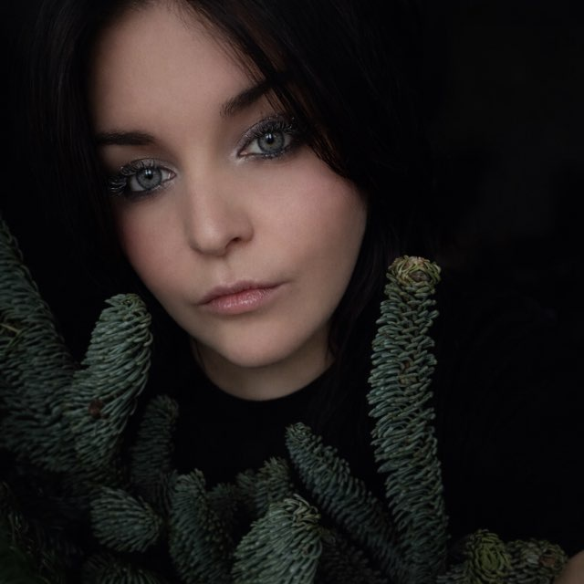

---

## Дмитрий Крылов
всем привет!

я Дима Крылов, 15+ лет в брендинге, заведую бренд-студией @deezstudio

в 2025 году выступал на DesignProsmotr в Питере

сейча все больше интересует экономика, инвестиции, психология и бизнес.

играю в пинг-понг, футбол, люблю современное искусство

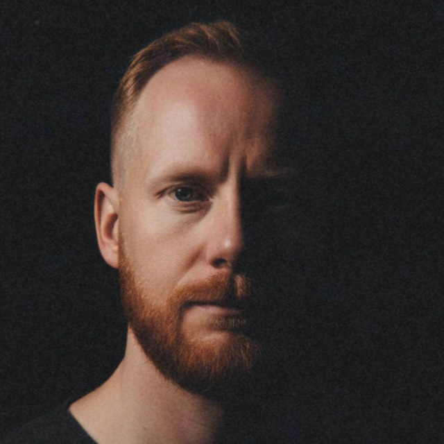

---

## Света Люлюшина
Всем привет! Я Света, лид в UX-исследованиях. Почти 4 года работаю в финтехе (ДОМ.РФ, Альфа-банка для бизнеса). Провожу исследования с юзерами, немного помогаю дизайнерам писать тексты для интерфейсов, а в последний год попробовала себя в роли продуктового дизайнера в своей компании.

Хотела бы и дальше пробовать себя как дизайнер, не только исследовать, но и создавать.

❤️‍🔥 Рада присоединиться

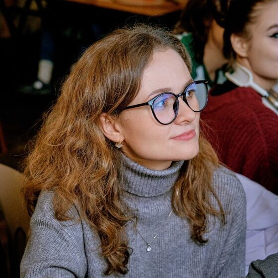
Telegram: https://t.me/lyulyushina

---

## Даша Попова
Всем Привет! Я Даша, UX-дизайнер. Работаю дизайнером в стартапе около года и фрилансю, пытаюсь попасть в бигтех, набираюсь опыта.
Питаю интерес к высоконагруженным интерфейсам, но опыта в таковых пока не имею 🙂

Рада познакомиться и присоединиться к команде!

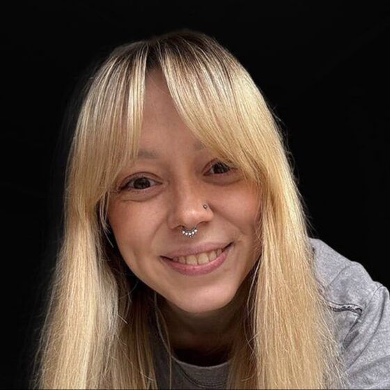
Telegram: https://t.me/popova_d_fm

---

## Konstantin Pugovkin
Всем привет! Меня Костя зовут, я продуктовый дизайнер. Работал на жёлтые банки 💛💛 и еще кое-где.

Помогаю компаниям сэкономить или заработать, ускоряя внутренних и внешних сотрудников, которые:
- отвечают на вопросы о банковских продуктах;
- проверяют адекватность клиентов перед выдачей займов;
- оценивают и страхуют имущество как залог (морские суда к примеру)

Еще кое-что понимаю в workforce management, работал с раздачей задач на оффлайн точках и выплатами за проделанную работу

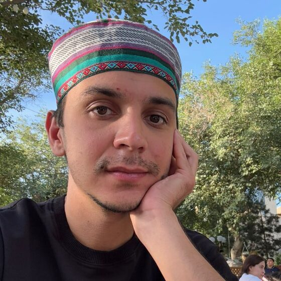
Telegram: https//t.me/zelenoglazoe_taxi

---

## Катя
Всем привет! Меня зовут Катя и я react front-end developer. За плечами у меня несколько фриланс заказов на сайты-визитки и несколько пройденных геймджемов. Ковыряю ThreeJS, Gsap, MatterJS и прочие фреймворки для анимаций

 Пришла сюда за получением опыта работы в команде и буду рада познакомиться и поработать в проекте 😋

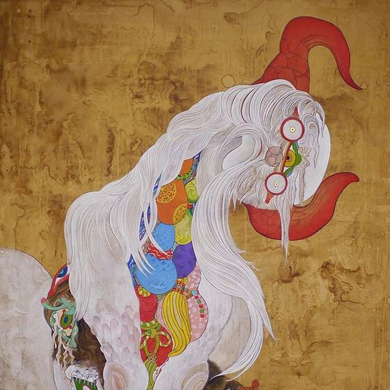
Telegram: https://t.me/littleprettybat

---

## Мария Дубинина
Всем привет!

Я Маша и я в дизайне уже больше 15 лет, из них 5 — графдизайн, года 3 веб-дизайн, а остальные 7 в продуктовом дизайне.

Почтатех 2019-2023 гг.
— Разогнали вместе с командой Админку из двух страниц для 100 пользователей до огромной CRM для почти 5000 пользователей.
— Удостоверяющий центр как для внутренних сотрудников, так и для внешнего пользователя с нуля.
— По мелочи: ЭДО, ЛК международного бизнеса, Карго.

Самокат 2023-2025 гг.
— CRM с нуля для сервиса Proзакупка (оптовая закупка в Китае)
— ЛК для китайских поставщиков

Озон Банк — работаю прямо сейчас😊

Сильные стороны:
Превращаю хаус в структурированный кайф;
Общаюсь на «ты» с продажниками;
Сложные системы — моя стихия.

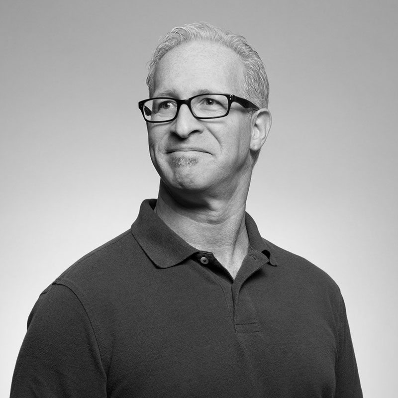
Telegram: https://t.me/maria_7720

---

## Владислав
Привет! 
Я Влад — продуктовый дизайнер, но последние пару лет, как Лид, ушел больше в менеджмент задач и процессов, и артдирекшн. 

Чем занимаюсь 
— Работаю с web/app и интерфейсом КСО.
— работаю с UX/UI, бренд-, нейро- и видео-дизайном. 
— создал с нуля три с половиной дизайн-системы для е-ком продуктов. 
— работал в стартапах, на фрилансе, под крылом «Сбера», но по душе: средний бизнес. 
— наибольшая насмотренность в сфере е-ком, а точнее фудтех. 
— опыт B2C 80%, B2B 20%

Как хобби: интересуюсь инвестициями и нейросетями. 

Черпаю вдохновение когда мою посуду или смотрю на листовки в почтовом ящике 😈

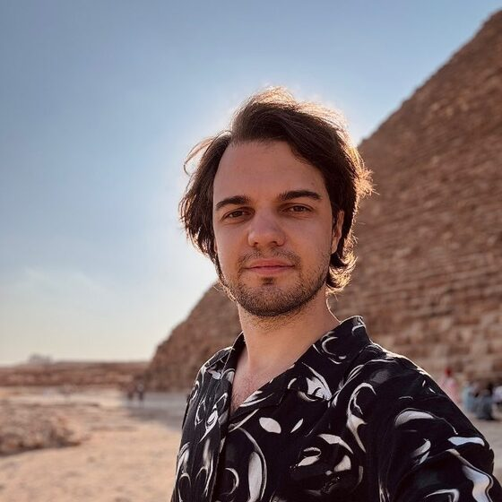
Telegram: https://t.me/yakiimow

---

## Кирилл
Всем привет!
Я Кирилл, в дизайне 9 лет, сначала создал студию и делал сайты на заказ, потом делал ed-tech стартап, дальше 2 продукта в Action group, запустил 4 новых модуля. Пришел поработать над классным продуктом, и рад стать частью комьюнити.

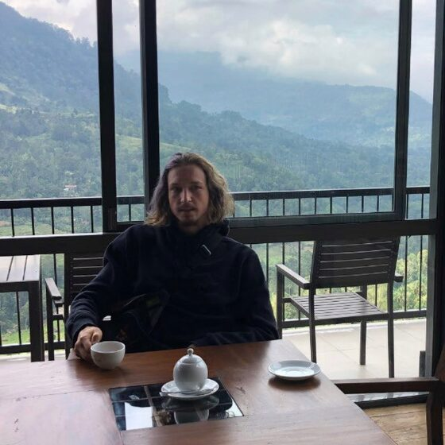
Telegram: https://t.me/bokettoboi

---

## Тоня
Всем привет. Я — Тоня, продуктовый дизайнер. Вообще в дизайне с 2017 года. Начинала со студий. Делала сайты, порталы, а так же страницы для Рив Гоша, Музторга, Вотони, Европкара и других. 

Потом пришла в Юмани, работала с Мишей. Набиралась уму-разуму) успела поработать в командах регистрации, авторизации, идентификации, переводов, пополнений, с интерфейсами сервиса поддержки. 

Последнее время занималась проектами ai-помощника для упрощения получения аналитической информации ориентированного на запросы продакт менеджеров;
умного помощника для ответов на вопросы и поиска нужной информации для всех сотрудников компании;
ai-помощника сервиса поддержки.

Буду рада поучаствовать в крутом проекте 🩷

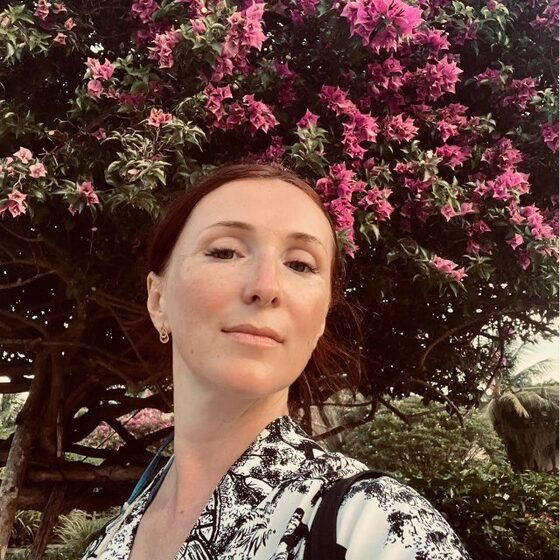
Telegram: https://t.me/Tosinka

---

## Pavel Avdeev
Всем привет! Я — Паша.

В дизайне с 2012 года. Начинал с графического дизайна — айдентика, брендинг, упаковка, первые клиенты и самостоятельные проекты. Со временем ушёл глубже в digital и перешёл от визуала к продуктовой логике и системному мышлению.

Работал над сложными цифровыми продуктами в разных индустриях.

Проектировал интерактивные терминалы и системы навигации для общественных пространств — ТЦ, музеев, парков и бизнес-площадок, где цифровой слой становится частью физической среды.

Участвовал в разработке систем для аэропортов от интерфейсов сдачи багажа до решений, связанных с процессами его сортировки и загрузки в самолёт. 

Работал над проектами по сбору данных и телематике для развития беспилотных систем, включая интерфейсы для электромобиля и продукты на стыке данных, аналитики и пользовательского опыта.

Также занимался e-com и retail экосистемами, включая проекты для M.Video и других крупных компаний, где фокус был на масштабируемости, метриках и продуктовой эффективности.

Проектировал не только мобильные и веб-интерфейсы, но и целые phygital-системы. Терминалы, админ-панели, омниканальные сервисы, дизайн-системы. 

Сейчас учусь на руководителя проектов в области ИИ. Делаем для команды из Союзмультфилма для сверок график, которые готовят несколько команд с одним персонажем, но с разными сюжетами. Где компьютерное зрение может выявить деффекты или ошибки, что облегчит жизнь команде. 

Вижу, как индустрия меняется, и сознательно углубляюсь в AI-направление. Поэтому могу быть полезен не только как продуктовый дизайнер, но и интегрировать ИИ в продукты и процессы.

Сейчас нигде не работаю, провожу консультации, наставничество и открыт к новым предложениям, как по продуктам c RnD, так и по AI-проектам)

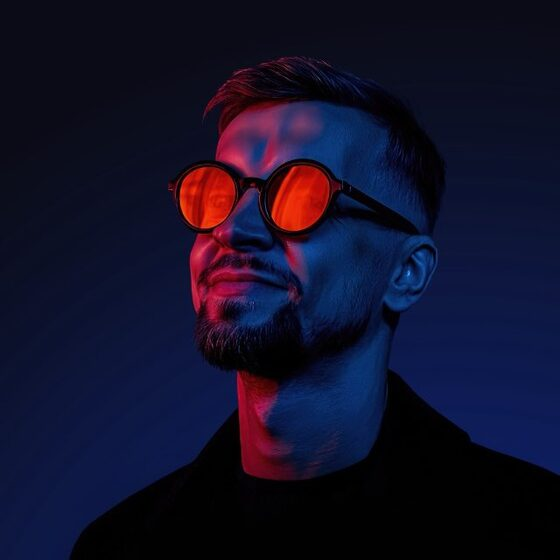
Telegram: https://t.me/emikman

---

## Sergey Sirenko
Всем привет! 

Я Сергей, 15+ лет в дизайне, 6+ лет проектирую дизайн-системы и веду команды архитекторов. Прошёл через ад многое, в т.ч. Яндекс (Миша, Сава, Толик и многие привет-привет), Positive Texhnologies, VK, Max, Совкомбанк и других классных ребят. Интегрирую системы, лечу процессы, менторю ребят и компании, стал недавно постить мысли в t.me/storyshortsystem

Тут посмотрю, поныряю, может буду чем полезен)

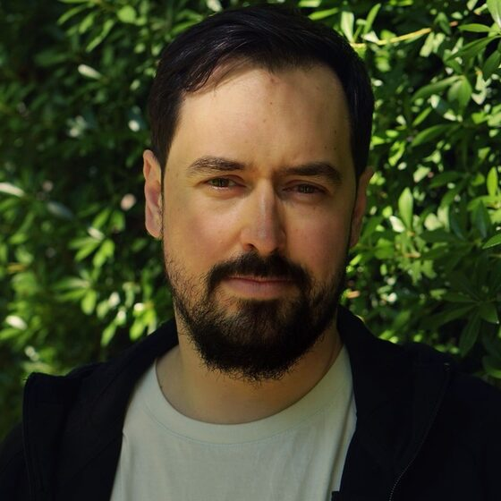
Telegram: https://t.me/desexpert

---

## Sergey Golosov
Всем привет!
Я — Сергей тоже) В дизайне 15+. Работал в агенстве БюроБюро занимался дизайном от концептов до реализации корпоративных сайтов Инвитро, Райффайзен Капитал, Мотив телеком. Затем перешел в продутовый дизайн в Открытие Банк, развивал направления команд Ипотека, Private и Premium, Digital. Разрабатывал дизайн-систему банка под обновленный брендинг. Сейчас Арт-директор направления онлайн в РГС занимаюсь управлением и менеджментом команды дизайна. Запустил с классными ребятами 2 miniapp в телеграмм Fanton и Bcoin 2048 (ссылки не прикладываю чтоб не было рекламой))))

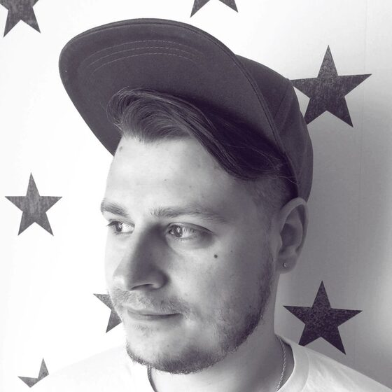
Telegram: https://t.me/serjmolo

---
